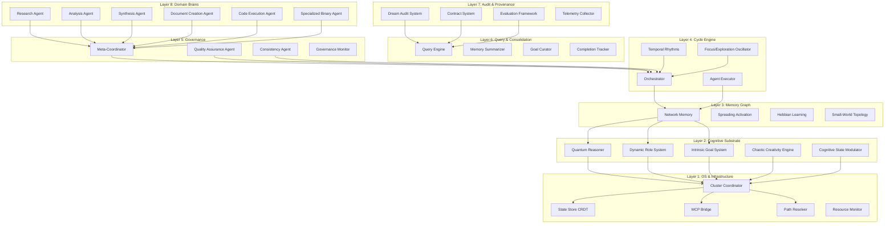
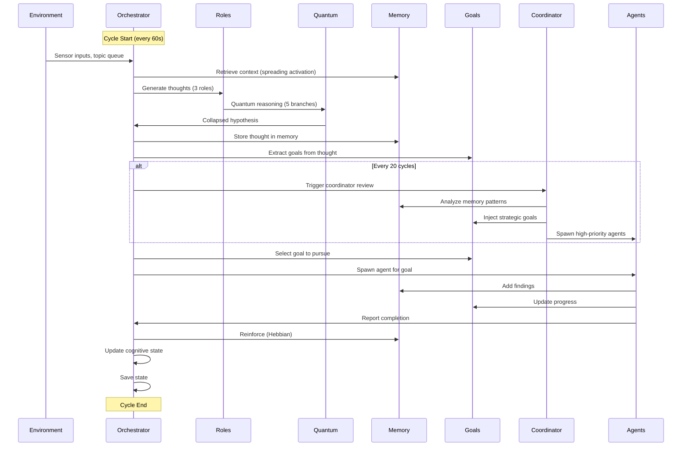
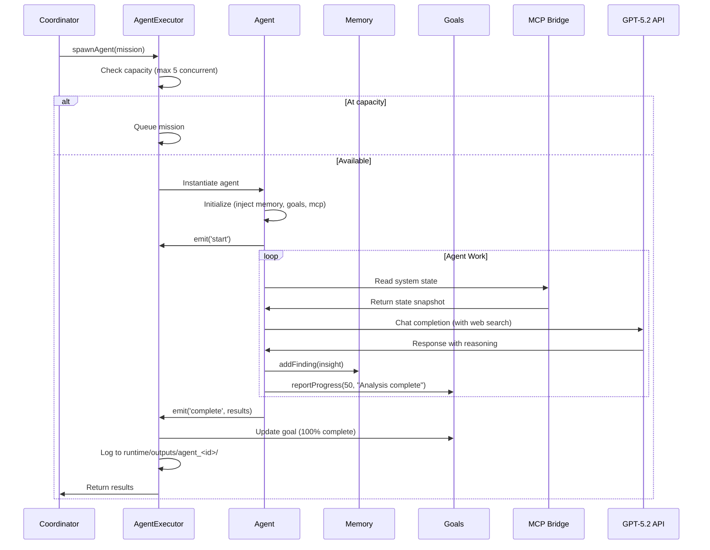
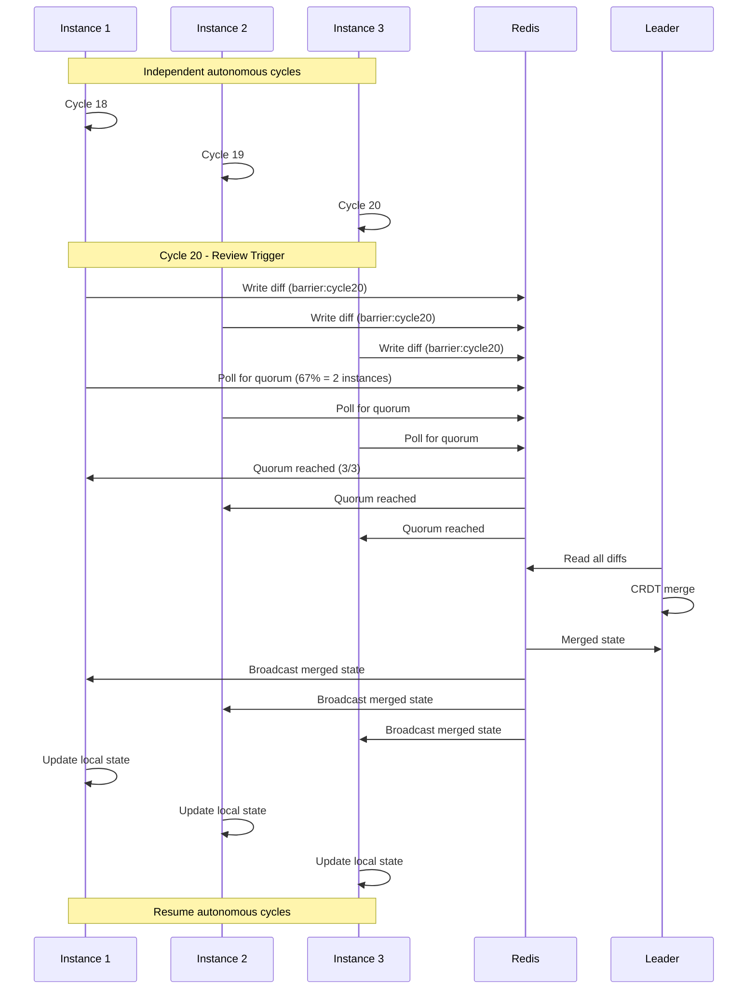
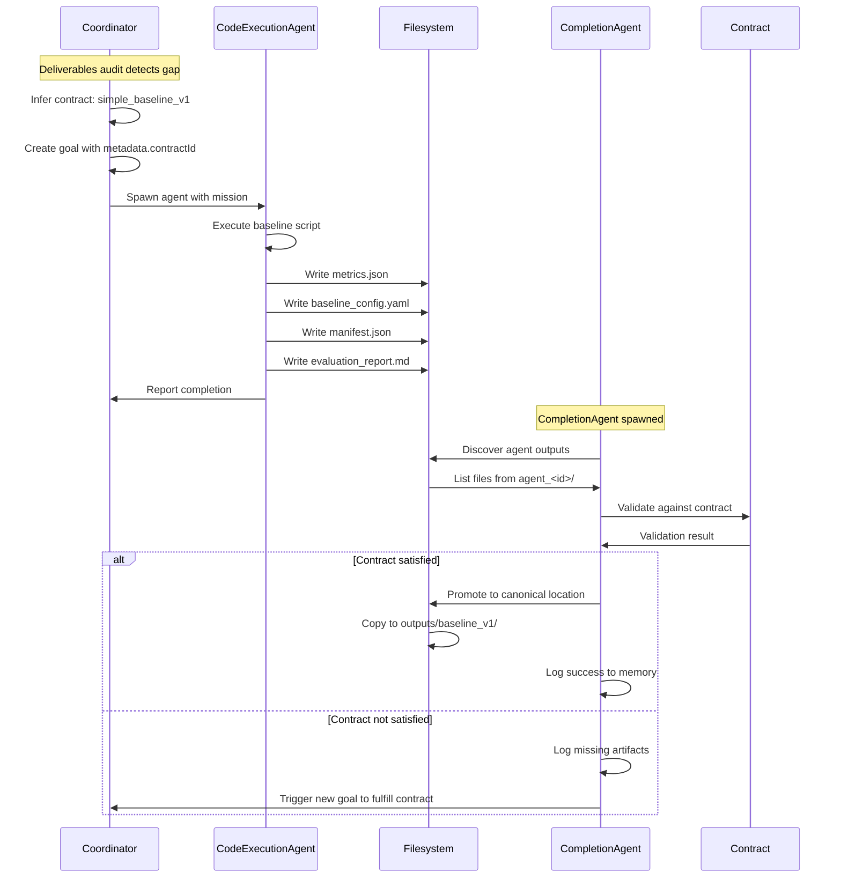
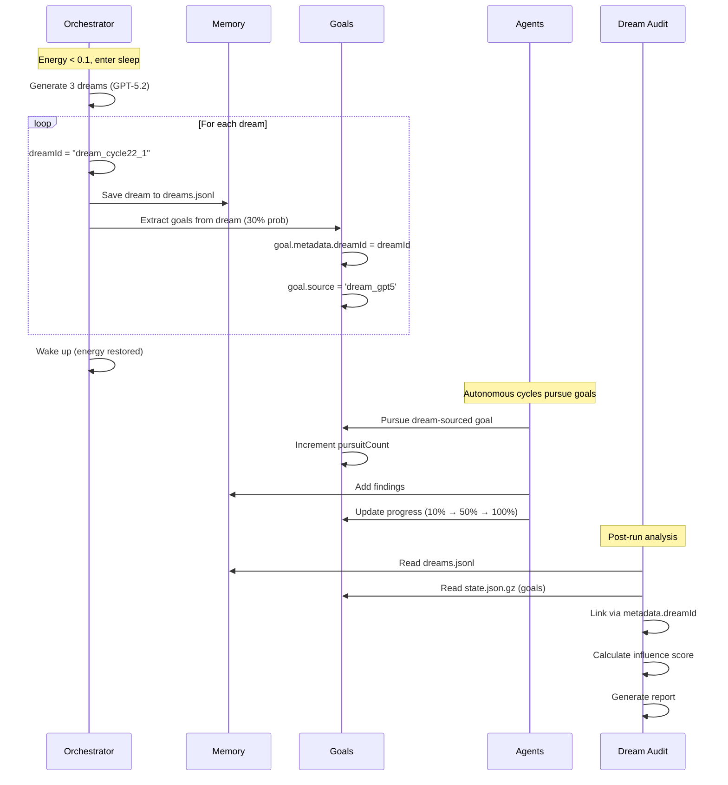
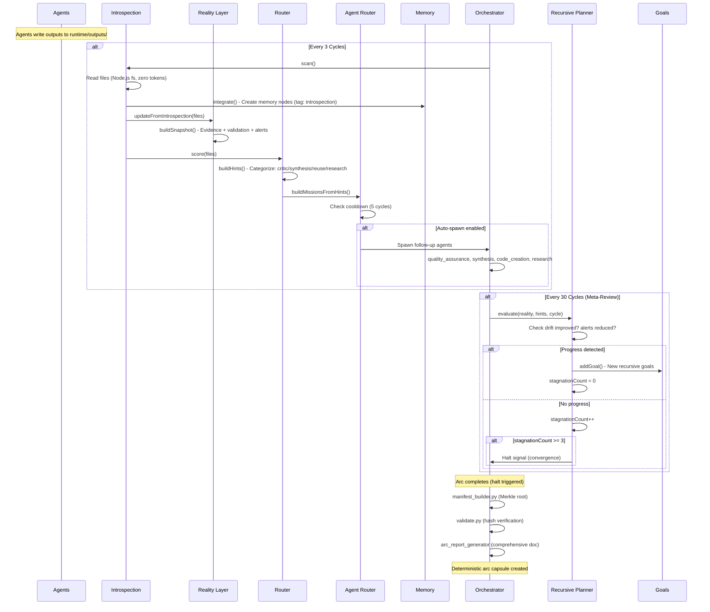
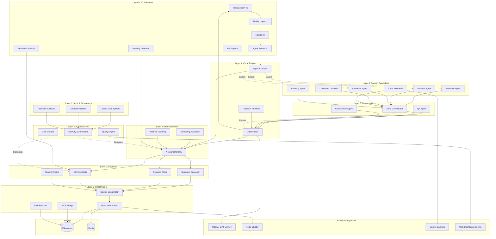

# COSMO Technical Architecture Document
**Cognitive Orchestration System for Multi-modal Operations**

**Document Version:** 3.0  
**Date:** December 5, 2025  
**Classification:** Technical Specification  
**Audience:** CTO, CISO, Technical Architects  
**Update:** V3 Recursive Cognitive Engine with complete substrate layer

---

## Executive Summary

COSMO is an autonomous AI research system that implements bio-inspired cognitive architecture with multi-agent coordination, distributed processing capabilities, and complete provenance tracking. The system operates as a self-directed research brain capable of exploring domains, forming hypotheses, executing code, and synthesizing knowledge across extended time horizons.

**Key Capabilities:**
- Autonomous multi-agent swarm with 14 specialist agent types
- Network memory graph with spreading activation and Hebbian learning
- Quantum-inspired reasoning with parallel hypothesis exploration
- Dream-state consolidation with measurable research influence
- Distributed cluster operation with active-active CRDT synchronization
- Contract-driven output validation and canonical artifact management
- Complete audit trail from dreams through research to deliverables
- **V3 Cognitive Substrate:** Self-awareness via introspection, reality grounding, recursive planning
- **Deterministic Verification:** Manifest generation with Merkle roots, hash validation, arc reports
- **Infrastructure Optimization:** LLM-free file operations (200x faster, zero token cost)

**Technology Stack:**
- **Core:** Node.js 18+
- **AI Models:** OpenAI GPT-5.2, GPT-5 Mini, GPT-5.1 Codex Max (via Responses API)
- **Storage:** Filesystem (primary), Redis (cluster coordination)
- **Protocols:** MCP (Model Context Protocol), HTTP, JSON-RPC
- **Containers:** Docker (for code execution sandboxing)

---

## 1. System Layers

COSMO implements an 8-layer architecture stack, from operating system integration up through domain-specific knowledge processing:



### Layer 0: V3 Cognitive Substrate

**Purpose:** Self-awareness, evidence grounding, recursive meta-cognition, and deterministic verification. This layer closes COSMO's feedback loop, enabling it to read its own outputs, evaluate progress recursively, and produce verifiable research arcs.

**Components:**

#### Introspection Module (`src/system/introspection.js`, 265 lines)

**Responsibilities:**
- Scans `runtime/outputs/` every 3 cycles for new agent outputs
- Reads file content using Node.js fs (not MCP - zero token cost)
- Creates memory nodes tagged 'introspection' with file previews (max 400 chars)
- Maintains checkpoint file to avoid re-importing on restarts
- Deduplicates using memory.query() to prevent duplicate nodes

**Configuration:**
```yaml
introspection:
  enabled: true
  maxFilesPerCycle: 10
  maxPreviewLength: 400
```

**Key Methods:**
- `scan()` - Finds new/modified files since last scan (mtime-based)
- `integrate(items)` - Creates memory nodes from file previews
- `walkForCandidates(dir)` - Recursively finds content files (skips .json, .log)

**Performance:**
- Scan time: <10ms per cycle (10 files)
- Memory overhead: ~1 node per file  
- Token cost: Zero (pure Node.js fs operations)

#### Reality Layer (`src/system/reality-layer.js`, 133 lines)

**Responsibilities:**
- Builds structured snapshots of system state
- Loads validation and drift reports (if exist)
- Generates alerts for critical issues (validation failures, high drift)
- Provides context object for thought generation

**Snapshot Structure:**
```javascript
{
  timestamp: Date.now(),
  recentOutputs: [{ filePath, agentType, agentId, preview }],
  validation: { status, artifacts_verified, errors },
  drift: { percentartifactschanged, artifacts_modified },
  alerts: [{ type, message, severity }]
}
```

**Integration:**
- Called after introspection scan
- Snapshot added to context.reality
- Dynamic roles inject into prompts
- Grounds thoughts in actual evidence

#### Introspection Router (`src/system/introspection-router.js`, 120 lines)

**Responsibilities:**
- Scores introspected files by importance (heuristic, no LLM)
- Categorizes outputs: critic, synthesis, reuse, research
- Generates routing hints for Agent Router

**Scoring Logic:**
```javascript
// Agent type scoring
if (agentType === 'code-creation') score += 2
if (agentType === 'document-analysis') score += 2

// Content scoring  
if (/error|fail|contradiction/.test(preview)) score += 1
if (/manifest|validation/.test(preview)) score += 1
```

**Output:**
```javascript
{
  scored: [{ file, score, agentType }],
  hints: {
    critic: [{ file, reason }],
    synthesis: [{ file, reason }],
    reuse: [{ file, reason }],
    research: [{ file, reason }]
  }
}
```

#### Agent Router (`src/system/agent-routing.js`, 105 lines)

**Responsibilities:**
- Converts routing hints into agent mission specifications
- Auto-spawns follow-up agents (optional, cooldown-governed)
- Feeds missions to existing AgentExecutor

**Mission Generation:**
```javascript
// Contradiction detected → Spawn QA agent
{ 
  agentType: 'quality_assurance',
  goalId: 'routing_critic_{timestamp}',
  description: 'Investigate contradictions in recent outputs',
  successCriteria: ['Identify contradictions', 'Propose resolutions'],
  createdBy: 'agent_router'
}
```

**Safety:**
- Cooldown: 5 cycles between routing spawns
- Max missions: 2 per cycle
- Priority filtering
- Respects concurrency limits

#### Memory Governor (`src/system/memory-governor.js`, 122 lines)

**Responsibilities:**
- Tracks memory node metadata (activations, last touched cycle)
- Applies exponential decay (half-life: 200 cycles)
- Identifies pruning candidates (activation < 0.1)
- Advisory by default (logs only, doesn't delete)

**Decay Model:**
```javascript
activation = activation * Math.pow(0.5, ageCycles / halfLifeCycles)
```

**Configuration:**
```yaml
memoryGovernance:
  enabled: true
  applyPruning: false  # Advisory only (safe)
  decayHalfLifeCycles: 200
  pruneThreshold: 0.1
  maxNodesConsidered: 200
```

**Evaluation:** Runs every 20 cycles, logs candidates

#### Recursive Planner (`src/system/recursive-planner.js`, 184 lines)

**Responsibilities:**
- Meta-cognitive evaluation every 30 cycles
- Monitors drift scores and alert counts
- Detects stagnation (3 reviews with no progress)
- Adds new high-level goals to IntrinsicGoalSystem
- Triggers graceful halt on convergence

**Evaluation Logic:**
```javascript
evaluate(realitySnapshot, routingHints, cycleCount) {
  // Check progress indicators
  const driftImproved = currentDrift < lastDrift
  const alertsReduced = currentAlerts < lastAlerts
  
  if (!driftImproved && !alertsReduced) {
    stagnationCount++
    if (stagnationCount >= 3) return { continue: false, haltReason: 'stagnation' }
  }
  
  // Generate new goals from routing hints
  const newGoals = buildGoalsFrom(routingHints)
  return { continue: true, newHighLevelGoals: newGoals }
}
```

**Halt Conditions:**
- Max meta-iterations reached (8)
- Stagnation detected (3 no-progress reviews)
- Integrated with goal exhaustion check

#### Arc Report Generator (`src/system/arc-report-generator.js`, 308 lines)

**Responsibilities:**
- Generates comprehensive markdown reports at arc closure
- Documents goals, agents, findings, verification data
- Human-readable summary + machine-parsable JSON
- Integrates manifest and validation reports

**Report Structure:**
1. Executive Summary (purpose, outcome, convergence)
2. Goals Pursued (initial, recursive, completed, remaining)
3. Agent Activity (total, by type, auto-spawned count)
4. Cognitive Timeline (cycles, key thoughts)
5. Evidence & Verification (manifest, validation)
6. Memory Integration (nodes added, introspection count)
7. Recursive Planning Summary (iterations, stagnation, drift)
8. Outputs & Deliverables (by type, recent files)
9. Arc Metadata (machine-readable JSON)
10. Reproducibility (manifest reference, Merkle root)

**Output:** `runtime/outputs/reports/arc_report_{timestamp}.md`

#### Determinism Tools

**Manifest Builder (`tools/manifest_builder.py`, 151 lines)**
- Scans runtime/outputs/ recursively
- Computes SHA-256 for each file
- Generates canonical manifest (sorted, deterministic)
- Computes Merkle root from file hashes
- Atomic write with fsync

**Validator (`tools/validate.py`, 141 lines)**
- Loads manifest.json
- Rehashes all artifacts
- Compares against manifest hashes
- Generates validation_report.json
- Exit codes: 0=pass, 1=missing manifest, 2=validation failed

**CI Verify Script (`scripts/ci_verify.sh`, 75 lines)**
- Sets deterministic environment (LANG=C, TZ=UTC, etc.)
- Runs manifest builder
- Runs validator
- Fails if validation fails
- CI/CD integration ready

**Usage:**
```bash
# Generate manifest and validate
python3 tools/manifest_builder.py runtime
python3 tools/validate.py runtime

# Or use CI script
./scripts/ci_verify.sh runtime
```

**Key Features:**
- Zero LLM overhead (pure infrastructure)
- Complete feedback loop (agents → introspection → memory → thoughts)
- Recursive meta-cognition (self-improving goal trees)
- Deterministic verification (every arc reproducible)
- Intelligent convergence (detects completion)

### Layer 1: OS & Infrastructure

**Purpose:** Operating system integration, distributed coordination, and resource management.

**Components:**
- **Cluster Coordinator:** Manages distributed instances with quorum-based review synchronization
- **State Store (CRDT):** Conflict-free replicated data types for multi-writer consistency
- **MCP Bridge:** Model Context Protocol client/server for AI agent introspection
- **Path Resolver:** Canonical path management with symlink resolution
- **Resource Monitor:** CPU, memory, and disk usage tracking with alerts

**Key Files:**
- `src/cluster/cluster-coordinator.js` - Instance coordination and specialization
- `src/cluster/cluster-state-store.js` - Abstract CRDT store interface
- `src/cluster/backends/redis-state-store.js` - Redis-backed active-active store
- `src/cluster/backends/filesystem-state-store.js` - Filesystem-backed single-writer store
- `src/core/path-resolver.js` - Path canonicalization and validation
- `src/core/resource-monitor.js` - System resource tracking

### Layer 2: Cognitive Substrate

**Purpose:** Bio-inspired cognitive primitives that enable autonomous behavior.

**Components:**
- **Quantum Reasoner:** Explores 5 parallel reasoning branches with entanglement and tunneling
- **Dynamic Role System:** Self-spawning cognitive roles (curiosity, analyst, critic) with evolution
- **Intrinsic Goal System:** Self-discovered goals with uncertainty-driven prioritization
- **Chaotic Creativity Engine:** Edge-of-chaos RNN for non-deterministic idea generation
- **Cognitive State Modulator:** Mood, curiosity, and energy levels affecting behavior

**Key Files:**
- `src/cognition/quantum-reasoner.js` - Parallel hypothesis exploration
- `src/cognition/dynamic-roles.js` - Role spawning and evolution
- `src/goals/intrinsic-goals.js` - Goal discovery and rotation
- `src/creativity/chaotic-engine.js` - Chaotic RNN implementation
- `src/cognition/state-modulator.js` - Mood and energy dynamics

**Design Principles:**
- Autonomous operation without human-in-the-loop prompting
- Uncertainty as a first-class cognitive signal
- Temporal dynamics (energy decay, goal rotation, role evolution)
- Stochastic exploration balanced with focused exploitation

### Layer 3: Memory Graph

**Purpose:** Associative memory network with spreading activation and learning.

**Components:**
- **Network Memory:** Graph structure with nodes (concepts) and weighted edges (associations)
- **Spreading Activation:** Context retrieval via multi-hop activation propagation
- **Hebbian Learning:** "Neurons that fire together, wire together" - co-occurrence strengthening
- **Small-World Topology:** High clustering with occasional long-range bridges

**Key Files:**
- `src/memory/network-memory.js` - Core graph implementation
- `src/cluster/cluster-aware-memory.js` - Distributed memory wrapper

**Memory Operations:**
- `addNode(concept, embedding)` - Create memory node with vector embedding
- `addEdge(nodeA, nodeB, weight, type)` - Link concepts with typed relationship
- `activate(nodeIds)` - Spread activation from seed nodes
- `retrieveContext(query, maxNodes)` - Semantic search with spreading activation
- `reinforce(nodeIds)` - Hebbian weight strengthening for co-activated nodes

**Configuration:**
- Embedding Model: `text-embedding-3-small` (512 dimensions)
- Decay Function: Exponential (0.995 per hour)
- Spreading Depth: 3 hops
- Activation Threshold: 0.1

### Layer 4: Cycle Engine

**Purpose:** Orchestrates cognitive cycles, agent execution, and temporal rhythms.

**Components:**
- **Orchestrator:** Main cognitive loop coordinator (perception → cognition → action)
- **Agent Executor:** Manages multi-agent swarm with concurrent execution
- **Temporal Rhythms:** Sleep/wake cycles with dream consolidation
- **Focus/Exploration Oscillator:** Alternates between focused work and open exploration

**Key Files:**
- `src/core/orchestrator.js` - Main orchestration loop
- `src/agents/agent-executor.js` - Agent lifecycle management
- `src/temporal/rhythms.js` - Sleep cycle coordination
- `src/temporal/oscillator.js` - Focus/exploration switching

**Cycle Phases:**
1. **Perception:** Gather inputs from environment sensors, topic queue, MCP tools
2. **Cognition:** Role-based ideation, quantum reasoning, goal management
3. **Action:** Spawn specialist agents based on coordinator review
4. **Reflection:** Analyze cycle outcomes, update memory, adjust state
5. **Consolidation:** (Sleep only) Dream generation, memory compression

**Timing:**
- Base cycle interval: 60 seconds (adaptive)
- Sleep cycle trigger: Energy < 0.1 or every 4 hours
- Dream generation: 2-4 dreams per sleep session
- Consolidation: Memory summarization during sleep

### Layer 5: Governance

**Purpose:** Strategic coordination, quality control, and cross-agent consistency.

**Components:**
- **Meta-Coordinator:** Reviews accumulated work every N cycles, creates strategic goals
- **Quality Assurance Agent:** Validates outputs for novelty, consistency, and factuality
- **Consistency Agent:** Ensures cross-agent agreement and resolution of conflicts
- **Governance Monitor:** Tracks cluster-wide compliance and policy adherence

**Key Files:**
- `src/coordinator/meta-coordinator.js` - Strategic review and goal injection
- `src/agents/quality-assurance-agent.js` - Output validation
- `src/agents/consistency-agent.js` - Cross-agent consistency checking
- `src/cluster/governance/governance-monitor.js` - Cluster governance tracking

**Meta-Coordinator Review Cycle:**
1. **Deliverables Audit:** Check if contract obligations are met
2. **Agent Performance Review:** Analyze recent agent outcomes
3. **Memory Pattern Analysis:** Identify emerging themes in memory graph
4. **Goal Portfolio Review:** Assess goal diversity and progress
5. **Strategic Decisions:** Create high-priority goals to address gaps
6. **Specialization Routing:** (Cluster mode) Route goals to specialized instances

**Review Frequency:** Every 20 cycles (configurable)

### Layer 6: Query & Consolidation

**Purpose:** Knowledge synthesis, memory compression, and canonical output management.

**Components:**
- **Query Engine:** Natural language interface to system state and memory
- **Memory Summarizer:** Compresses memory graph using extractive + abstractive summarization
- **Goal Curator:** Runs campaigns and synthesis across related goals
- **Completion Tracker:** Monitors task progress and contract fulfillment

**Key Files:**
- `src/dashboard/query-engine.js` - NL query processing
- `src/memory/summarizer.js` - Memory compression
- `src/goals/goal-curator.js` - Goal campaign management
- `src/core/completion-tracker.js` - Progress tracking

**Consolidation Triggers:**
- Memory size > 500 nodes
- Sleep cycle entry
- Manual request via dashboard
- Cluster merge operation

**Summarization Strategy:**
1. Extract high-activation nodes (top 30%)
2. Cluster related concepts
3. Generate cluster summaries (GPT-5.2)
4. Create super-nodes linking summaries
5. Archive original nodes with pointers to summaries

### Layer 7: Audit & Provenance

**Purpose:** Complete traceability from inputs through processing to outputs.

**Components:**
- **Dream Audit System:** Links dreams → goals → research outcomes with influence scoring
- **Contract System:** Defines expected artifacts and validates actual outputs
- **Evaluation Framework:** Tracks evaluation runs with reproducibility manifests
- **Telemetry Collector:** Structured event logging for post-hoc analysis

**Key Files:**
- `scripts/audit_dream_influence.js` - Dream causality analysis
- `src/schemas/output-contracts.js` - Contract registry
- `src/evaluation/evaluation-framework.js` - Evaluation tracking
- `src/core/telemetry-collector.js` - Event collection

**Audit Capabilities:**
1. **Dream Tracing:** Which dream produced which goal? Did it lead to research?
2. **Contract Validation:** Do outputs satisfy required artifacts?
3. **Agent Provenance:** Which agent created which file?
4. **Cross-Instance Attribution:** In clusters, which instance contributed what?

**Contract Example:**
```javascript
{
  contractId: 'simple_baseline_v1',
  artifacts: [
    { filename: 'metrics.json', required: true },
    { filename: 'baseline_config.yaml', required: true },
    { filename: 'manifest.json', required: true },
    { filename: 'evaluation_report.md', required: true }
  ]
}
```

### Layer 8: Domain Brains

**Purpose:** Specialist agents with deep capabilities in specific task types.

**14 Specialist Agent Types:**

| Agent Type | Purpose | Key Capabilities |
|-----------|---------|------------------|
| **Research Agent** | Web search, literature review | GPT-5.2 with web search, citation tracking |
| **Analysis Agent** | Data analysis, pattern detection | Statistical analysis, visualization |
| **Synthesis Agent** | Cross-topic integration | GPT-5.2 strategic model, multi-document synthesis |
| **Document Creation Agent** | Report writing, documentation | Structured output, markdown generation |
| **Code Execution Agent** | Run scripts, process data | Docker sandboxing, stdout/stderr capture |
| **Code Creation Agent** | Generate code artifacts | GPT-5.2 with file planning, retry logic |
| **Planning Agent** | Task decomposition | Break goals into sub-tasks |
| **Integration Agent** | Cross-agent coordination | GPT-5.2 strategic model, dependency resolution |
| **Exploration Agent** | Novel idea generation | High temperature, curiosity-driven |
| **Completion Agent** | Contract validation, promotion | Output discovery, canonical path promotion |
| **Document Analysis Agent** | Read and understand docs | Large context, extractive summarization |
| **Quality Assurance Agent** | Output validation | Novelty, consistency, factuality checks |
| **Consistency Agent** | Cross-agent agreement | Conflict detection and resolution |
| **Specialized Binary Agent** | Process binary files | PDF, images, spreadsheets |

**Agent Lifecycle:**
1. **Mission Creation:** Meta-Coordinator or user creates mission spec
2. **Agent Spawning:** AgentExecutor instantiates agent with mission
3. **Execution:** Agent runs with timeout protection (5-30 minutes)
4. **Progress Reporting:** Real-time progress updates to goal system
5. **Memory Integration:** Findings added to network memory
6. **Results Queue:** Outputs logged for downstream consumption
7. **Cleanup:** Resources released, status reported

**Agent Communication:**
- Shared memory graph (async)
- Message queue for direct agent-to-agent messages
- Results queue for outputs
- MCP tools for system introspection

---

## 2. Component Descriptions

### 2.1 Core Infrastructure

#### Orchestrator (`src/core/orchestrator.js`)

**Responsibilities:**
- Main cognitive loop execution (79 files, 4,025 lines)
- Subsystem coordination (memory, goals, agents, clustering)
- Sleep/wake cycle management with dreams
- State persistence and crash recovery
- Telemetry collection

**Key Methods:**
- `initialize()` - Load state, init subsystems, register crash handlers
- `start()` - Begin cognitive loop
- `runCycle()` - Execute one perception-cognition-action cycle
- `enterSleep()` - Initiate sleep with dream generation
- `saveState()` - Persist state to `runtime/state.json.gz`

**State Management:**
- Cycle counter and timestamps
- Journal (thought history)
- Last summarization/consolidation timestamps
- Sleep session tracking
- Cluster sync telemetry

#### Unified Client (`src/core/unified-client.js`)

**Responsibilities:**
- OpenAI API client with GPT-5.2 support
- Extended reasoning and web search
- MCP tool integration (filesystem, web, GitHub)
- Automatic retry with exponential backoff
- Token usage tracking

**Supported Models:**
- `gpt-5.2` - Extended reasoning, 128K context
- `gpt-5-mini` - Fast, cost-efficient, 128K context
- `text-embedding-3-small` - 512D embeddings

**MCP Tool Usage:**
```javascript
const response = await client.chat({
  messages: [...],
  tools: [
    { type: 'mcp', server: 'filesystem', tool: 'read_file' },
    { type: 'mcp', server: 'web', tool: 'search' }
  ],
  enableMCPTools: true
});
```

#### Path Resolver (`src/core/path-resolver.js`)

**Responsibilities:**
- Canonical path resolution with symlink following
- Runtime directory structure management
- Deliverable path generation (agent outputs, exports)
- File access validation

**Directory Structure:**
```
runtime/  (symlink to runs/<selected_run>/)
├── outputs/          # Agent-generated outputs
│   ├── manifests/    # V3: Deterministic manifests
│   │   ├── manifest.json        # Complete artifact catalog
│   │   └── manifest.merkle      # Merkle root for verification
│   ├── reports/      # V3: System reports
│   │   ├── validation_report.json   # Hash verification results
│   │   ├── drift_report.json        # Artifact drift tracking
│   │   └── arc_report_{id}.md       # Comprehensive arc documentation
│   ├── code-creation/    # Per-agent-type directories
│   │   └── agent_123/    # Per-agent output directory
│   ├── document-creation/
│   ├── code-execution/
│   └── ...
├── exports/          # Exported deliverables
├── metadata/         # V3: System metadata
│   └── introspection_checkpoint.json  # Scan state persistence
├── coordinator/      # Meta-coordinator reviews
├── state.json.gz     # Compressed system state
├── thoughts.jsonl    # Cycle-by-cycle thoughts
├── dreams.jsonl      # Dream records
└── topics-queue.json # Topic injection queue
```

### 2.2 Memory & Cognition

#### Network Memory (`src/memory/network-memory.js`)

**Architecture:**
- Graph structure: `Map<nodeId, {concept, embedding, activation, cluster}>`
- Edge structure: `Map<"nodeA->nodeB", {weight, type, accessed}>`
- Cluster structure: `Map<clusterId, Set<nodeId>>`

**Operations:**
```javascript
// Create memory node
const nodeId = await memory.addNode('quantum entanglement', embedding);

// Link concepts
await memory.addEdge(nodeId1, nodeId2, 0.8, 'relates_to');

// Retrieve context
const context = await memory.retrieveContext('quantum physics', { maxNodes: 5 });
// Returns: [nodeId1, nodeId2, ...] sorted by activation

// Hebbian reinforcement
await memory.reinforce([nodeId1, nodeId2, nodeId3]);
// Strengthens weights between co-activated nodes
```

**Spreading Activation Algorithm:**
1. Initialize: Seed nodes get activation = 1.0
2. Propagate: For depth 1 to maxDepth:
   - For each active node:
     - Get neighbors via edges
     - Transfer activation: `neighbor.activation += current.activation * edge.weight * decayFactor`
3. Threshold: Keep nodes with activation > threshold
4. Rank: Sort by activation strength

**Small-World Topology:**
- High clustering: Concepts within domain are densely connected
- Short paths: Occasional "bridge" edges span domains
- Periodic rewiring: Every 10 minutes, 5% of edges rewired randomly

#### Quantum Reasoner (`src/cognition/quantum-reasoner.js`)

**Metaphor:** Quantum superposition of reasoning paths that "collapse" to strongest hypothesis.

**Process:**
1. **Branch Generation:** Create 5 parallel reasoning branches with varied assumptions
2. **Independent Evolution:** Each branch reasons without knowledge of others
3. **Entanglement:** Detect when branches converge on similar conclusions
4. **Tunneling:** Low-probability branches can "tunnel" to higher-weight conclusions
5. **Collapse:** Select winner based on weighted voting

**Configuration:**
```yaml
reasoning:
  parallelBranches: 5
  collapseStrategy: weighted  # or 'first', 'consensus'
  entanglementEnabled: true
  tunnelingProbability: 0.02  # 2% chance of surprising outcome
```

**Output:**
```javascript
{
  winner: { hypothesis: "...", confidence: 0.85, branchId: 3 },
  branches: [
    { id: 1, hypothesis: "...", weight: 0.15 },
    { id: 2, hypothesis: "...", weight: 0.20 },
    { id: 3, hypothesis: "...", weight: 0.85 },  // Winner
    { id: 4, hypothesis: "...", weight: 0.40 },
    { id: 5, hypothesis: "...", weight: 0.30 }
  ],
  entanglements: [ [1,2], [3,4] ],  // Branches with similar conclusions
  surpriseFactor: 0.02  // Tunneling events
}
```

#### Dynamic Role System (`src/cognition/dynamic-roles.js`)

**Purpose:** Self-spawning cognitive perspectives that generate thoughts.

**Initial Roles:**
- **Curiosity:** Generates novel questions
- **Analyst:** Examines existing topics
- **Critic:** Challenges assumptions

**Role Evolution:**
- Roles can spawn new roles when surprise > 0.7
- Roles can merge when redundancy detected
- Roles can die when success rate < 0.3
- Maximum 15 active roles at any time

**Role Execution:**
```javascript
const thought = await role.generate({
  context: [...memory nodes...],
  recentThoughts: [...last 5 thoughts...],
  mood: 0.6,  // Cognitive state
  energy: 0.8
});
// Returns: { text, confidence, tags, metadata }
```

**Guided Mode Override:**
When in guided mode, role prompts are biased toward domain focus:
```javascript
// Autonomous mode
prompt: "Generate ONE novel question (2-4 sentences)"

// Guided mode
prompt: "Generate ONE question about {domain}. {context}"
```

### 2.3 Agent System

#### Agent Executor (`src/agents/agent-executor.js`)

**Responsibilities:**
- Agent registry and lifecycle management
- Concurrent agent spawning (max 5 by default)
- Mission queue with priority scheduling
- Agent timeout enforcement
- Results aggregation

**Agent Registration:**
```javascript
agentExecutor.registerAgentType('research', ResearchAgent);
agentExecutor.registerAgentType('analysis', AnalysisAgent);
// ...13 total agent types
```

**Agent Spawning:**
```javascript
const agent = await agentExecutor.spawnAgent({
  type: 'research',
  goalId: 'goal_123',
  description: 'Research quantum computing applications',
  successCriteria: 'Find 3+ recent papers',
  maxDuration: 600000  // 10 minutes
});

// Returns: { agentId, status, results, findings }
```

**Concurrent Execution:**
- Tracks running agent count
- Queues requests when at capacity
- Kills agents on timeout
- Logs all agent events to `runtime/outputs/agent_<id>/`

#### Base Agent (`src/agents/base-agent.js`)

**All agents extend BaseAgent:**

```javascript
class MyAgent extends BaseAgent {
  async execute() {
    // 1. Report initial progress
    await this.reportProgress(10, 'Starting analysis');
    
    // 2. Use GPT-5.2 client
    const response = await this.gpt5.chat({
      messages: [...],
      reasoning_effort: 'medium',
      enableWebSearch: true
    });
    
    // 3. Store findings in memory
    await this.addFinding({
      type: 'insight',
      content: response.content,
      confidence: 0.8,
      tags: ['quantum', 'research']
    });
    
    // 4. Report completion
    await this.reportProgress(100, 'Analysis complete');
    
    return { summary: '...', findings: [...] };
  }
}
```

**Provided Capabilities:**
- `this.gpt5` - Unified GPT-5.2 client with web search
- `this.memory` - Network memory access
- `this.goals` - Goal system access
- `this.mcp` - MCP bridge for system introspection
- `this.pathResolver` - Canonical path generation
- `this.logger` - Structured logging
- `this.reportProgress(percent, message)` - Update goal
- `this.addFinding(finding)` - Store in memory
- `this.sendMessage(toAgentId, payload)` - Inter-agent messaging
- `this.discoverFiles(options)` - Find outputs from other agents

#### MCP Bridge (`src/agents/mcp-bridge.js`)

**Purpose:** Gives agents access to system introspection tools.

**Available Tools:**
```javascript
// Read system state
const state = await mcp.callTool('filesystem', 'read_system_state', {});
// Returns: { goals, memory, activeAgents, clusterStatus }

// List recent agent outputs
const outputs = await mcp.callTool('filesystem', 'list_agent_outputs', {
  agentType: 'research',
  maxAgeMs: 3600000  // 1 hour
});

// Read agent result
const result = await mcp.callTool('filesystem', 'read_agent_result', {
  agentId: 'agent_123'
});

// Inject goal
await mcp.callTool('filesystem', 'inject_goal', {
  description: 'Synthesize quantum research',
  priority: 0.8,
  source: 'agent_mcp'
});
```

**Security:**
- Agents can only read system state (no writes to core state)
- File access limited by `allowedPaths` configuration
- Tool approval level: 'never' (trusted internal tools)

### 2.4 Clustering

#### Cluster Coordinator (`src/cluster/cluster-coordinator.js`)

**Purpose:** Coordinates distributed COSMO instances with specialization.

**Modes:**
1. **Single-instance:** Uses local filesystem state store
2. **Active-Active (Redis):** CRDT-based multi-writer with conflict resolution
3. **Leader-Lease (Filesystem):** Single writer with Raft-inspired leader election

**Specialization Profiles:**
```yaml
cluster:
  specialization:
    enabled: true
    profiles:
      cosmo-1:
        name: "Research Specialist"
        tags: [research, analysis, web-search]
        agentTypes: [research, analysis, document_analysis]
        domains: [science, technology]
      cosmo-2:
        name: "Coding Specialist"
        tags: [code, execution, development]
        agentTypes: [code_execution, code_creation]
      cosmo-3:
        name: "Synthesis Generalist"
        tags: [synthesis, integration, planning]
        agentTypes: [synthesis, integration, planning]
```

**Review Barrier:**
- All instances synchronize before meta-coordinator reviews
- Quorum required: 67% of instances (min 2)
- Timeout: 60 seconds, then proceed anyway
- Each instance submits diff, leader merges with CRDT

**State Merge Algorithm:**
1. Collect diffs from all instances
2. Apply LWW (Last-Writer-Wins) for scalars
3. Apply Set Union for arrays (goals, memories)
4. Resolve conflicts with timestamps
5. Broadcast merged state to all instances

#### Redis State Store (`src/cluster/backends/redis-state-store.js`)

**CRDT Operations:**
```javascript
// Atomic goal claim (Lua script)
const claimed = await store.claimGoal(goalId, instanceId);

// Memory merge with vector clocks
await store.mergeMemory(memoryDiff, vectorClock);

// Leader election with lease renewal
const isLeader = await store.acquireLeadership(instanceId, leaseTtl);
```

**Redis Keys:**
```
cosmo:cluster:state:memory          # Serialized memory graph
cosmo:cluster:state:goals           # Serialized goal list
cosmo:cluster:leader:lease          # Leader election
cosmo:cluster:diffs:<instance>      # Per-instance diffs
cosmo:cluster:barrier:<cycle>       # Review barrier coordination
```

**Consistency Guarantees:**
- Atomic goal claims (no double execution)
- Eventual consistency for memory and goals
- Idempotent operations (tolerate duplicate diffs)
- Conflict resolution with timestamps

### 2.5 Governance & Quality

#### Meta-Coordinator (`src/coordinator/meta-coordinator.js`, 3,979 lines)

**V3 Optimization (December 2025):**
- **File Access:** Migrated from MCP (callMCPTool) to Node.js fs
- **Performance:** 160x faster audits (~8 seconds → <50ms)
- **Token Cost:** Zero (was ~1,500 tokens per review)
- **Reliability:** No API dependency for file operations

**Optimized Methods:**
- `auditDeliverables()` - Now uses fs.access() and fs.readdir()
- `countDeliverablesRecursive()` - Now uses fs.readdir() with withFileTypes
- `hasCodeFilesRecursive()` - Always used fs (retained)

**Review Phases:**

**1. Data Collection (5-10 seconds)**
```javascript
// Gather inputs
const recentThoughts = await readThoughtJournal(lastNcycles);
const goals = activeGoals.getGoals();
const agentResults = await discoverAgentResults(since: lastReview);
const memorySnapshot = memory.getHighActivationNodes(100);
const deliverablesAudit = await auditDeliverables();
```

**2. GPT-5.2 Strategic Analysis (30-60 seconds)**
```javascript
const review = await gpt5.chat({
  model: 'gpt-5-mini',
  reasoning_effort: 'low',
  messages: [
    { role: 'system', content: COORDINATOR_PROMPT },
    { role: 'user', content: templateReport }
  ]
});

// Parses structured JSON response:
{
  observedPatterns: [...],
  agentPerformance: [...],
  deliverablesGaps: [...],
  strategicRecommendations: [...],
  goalAdjustments: [...]
}
```

**3. Strategic Goal Injection**
```javascript
// High-priority goals from coordinator
for (const decision of review.strategicRecommendations) {
  if (decision.action === 'spawn_agent') {
    const goal = goals.addGoal({
      description: decision.description,
      agentType: decision.agentType,
      priority: 0.95,  // Higher than autonomous goals
      source: 'coordinator',
      metadata: decision.metadata
    });
  }
}
```

**4. Agent Spawning**
```javascript
// Spawn high-priority agents immediately
for (const goal of prioritizedGoals) {
  if (goal.priority > 0.9 && !goal.claimed) {
    await agentExecutor.spawnAgent({
      type: goal.agentType,
      goalId: goal.id,
      description: goal.description,
      metadata: goal.metadata
    });
  }
}
```

**Contract-Aware Goal Creation:**
```javascript
// Deliverables audit detects missing baseline
audit.gaps.push({ type: 'missing_baseline', severity: 'high' });

// Coordinator creates goal with contract metadata
const goal = {
  description: 'Run baseline evaluation',
  agentType: 'code_execution',
  priority: 0.95,
  metadata: {
    contractId: 'simple_baseline_v1',  // Links to contract
    expectedArtifacts: ['metrics.json', 'baseline_config.yaml', ...],
    canonicalOutputLocation: 'outputs/baseline_v1'
  }
};
```

#### Quality Assurance Agent (`src/agents/quality-assurance-agent.js`)

**Validation Dimensions:**
1. **Novelty:** Is this new information or redundant?
2. **Consistency:** Does this contradict existing memory?
3. **Factuality:** Are claims verifiable and sourced?

**Validation Process:**
```javascript
const validation = await qaAgent.validate({
  content: agentOutput,
  context: relatedMemoryNodes,
  checkNovelty: true,
  checkConsistency: true,
  checkFactuality: false  // Expensive, optional
});

// Returns:
{
  overallScore: 0.82,
  novelty: { score: 0.9, reasoning: "..." },
  consistency: { score: 0.7, issues: [...] },
  factuality: { score: null, skipped: true },
  recommendation: 'accept' | 'revise' | 'reject',
  confidence: 0.85
}
```

**Acceptance Thresholds:**
- `mode: 'strict'` - Require score ≥ 0.8 for acceptance
- `mode: 'balanced'` - Require score ≥ 0.7 (default)
- `mode: 'permissive'` - Require score ≥ 0.5

**Integration:**
- Coordinator can require QA validation for strategic goals
- Agents can self-validate before adding findings to memory
- Cluster mode: Cross-instance consistency checks

---

## 3. Data Flow

### 3.1 Perception → Cognition → Action Cycle



### 3.2 Agent Execution Flow



### 3.3 Cluster Synchronization Flow



### 3.4 Contract-Driven Output Flow



### 3.5 Dream → Goal → Research Flow



### 3.6 V3 Introspection & Recursive Flow



---

## 4. Integration Points

### 4.1 External AI Services

#### OpenAI API

**Endpoint:** `https://api.openai.com/v1/`

**Authentication:**
```bash
export OPENAI_API_KEY="sk-..."
```

**Models Used:**
- `gpt-5.2` - Strategic decisions, synthesis, complex reasoning
- `gpt-5-mini` - Reviews, classification, routine tasks
- `text-embedding-3-small` - Vector embeddings (512D)

**Features:**
- Extended reasoning (via `reasoning_effort` parameter)
- Web search (via `enable_web_search`)
- Tools (native function calling)
- Streaming responses
- Token usage tracking

**Rate Limits:**
- GPT-5.2: 500 requests/minute, 300K tokens/minute
- GPT-5 Mini: 5000 requests/minute, 2M tokens/minute
- Embeddings: 5000 requests/minute

### 4.2 MCP (Model Context Protocol)

**Purpose:** Standard protocol for AI agents to access tools and resources.

**COSMO as MCP Server:**
```javascript
// HTTP endpoint for agents
POST http://localhost:3347/mcp

// Available tools:
- read_system_state: Get current goals, memory, agents
- list_agent_outputs: Find outputs from recent agents
- read_agent_result: Read specific agent output
- inject_goal: Add goal to system
- read_memory_nodes: Query memory graph
```

**COSMO as MCP Client:**
```javascript
// Connect to external MCP servers
mcp:
  client:
    servers:
      - label: "filesystem"
        type: "http"
        url: "http://localhost:3347/mcp"
        allowedTools: [read_file, list_directory]
      - label: "github"
        type: "http"
        url: "https://api.github.com/mcp"
        allowedTools: [search_repos, read_file]
```

**Security:**
- Path restrictions via `allowedPaths` configuration
- Tool approval levels: `never` (auto), `if_denied` (ask once), `always` (ask every time)
- Request/response logging for audit

### 4.3 Container Runtime (Docker)

**Purpose:** Sandbox code execution agents to prevent system compromise.

**Configuration:**
```yaml
coordinator:
  codeExecution:
    enabled: true
    containerTimeout: 600000  # 10 minutes
    maxContainersPerReview: 1
    autoCleanup: true
```

**Container Lifecycle:**
```javascript
// 1. Create container
const container = await docker.createContainer({
  Image: 'python:3.11-slim',
  Cmd: ['python', '/workspace/script.py'],
  WorkingDir: '/workspace',
  HostConfig: {
    Binds: [`${hostPath}:/workspace:ro`],  // Read-only mount
    Memory: 512 * 1024 * 1024,  // 512MB limit
    NetworkMode: 'none'  // No network access
  }
});

// 2. Start and wait
await container.start();
const result = await container.wait();

// 3. Capture logs
const stdout = await container.logs({ stdout: true });
const stderr = await container.logs({ stderr: true });

// 4. Cleanup
await container.remove();
```

**Security Controls:**
- No network access (airgapped)
- Read-only workspace mounts
- Memory limits (512MB default)
- CPU limits (1 core)
- Timeout enforcement (kill after 10 minutes)
- Automatic cleanup (remove container after execution)

### 4.4 Web Dashboard

**Purpose:** Real-time monitoring and control interface.

**Endpoint:** `http://localhost:3344`

**Pages:**
- `/` - Overview dashboard (goals, memory, agents, cycle metrics)
- `/query` - Natural language query interface
- `/logs` - Real-time console streaming
- `/intelligence` - GPT-5.2 query engine with context
- `/agents` - Agent activity and results
- `/memory` - Memory graph visualization
- `/evaluation` - Evaluation tracking

**Query Engine:**
```javascript
// Natural language queries over system state
POST /api/query
{
  "query": "What research has been done on quantum computing?",
  "context": "last_20_cycles"
}

// Response:
{
  "answer": "...",
  "sources": [...memory nodes...],
  "confidence": 0.85,
  "reasoning": "..."  // Extended reasoning trace
}
```

**Real-time Updates:**
```javascript
// Server-Sent Events for live console
GET /api/stream/console

// WebSocket for state updates
WS /api/stream/state
```

### 4.5 Filesystem

**Primary Storage:**
- All state in `runtime/` directory
- Compressed JSON for state (gzip)
- JSONL for append-only logs (thoughts, dreams)
- Markdown for human-readable reports

**File Access Control:**
```yaml
mcp:
  client:
    servers:
      - label: "filesystem"
        allowedPaths:
          - "runtime/outputs/"
          - "runtime/exports/"
```

**Agents cannot access:**
- COSMO source code (`src/`)
- Configuration files (`src/config.yaml`)
- Other instances' runtime directories (cluster mode)
- System directories (`/etc`, `/usr`, etc.)

### 4.6 Redis (Cluster Mode)

**Purpose:** Distributed coordination and state replication.

**Configuration:**
```yaml
cluster:
  enabled: true
  backend: redis
  redis:
    url: "redis://localhost:6379"
    keyPrefix: "cosmo:cluster:"
```

**Operations:**
- Atomic goal claims (Lua scripts)
- Leader election with leases
- CRDT state merging
- Review barrier coordination
- Memory diff replication

**Consistency Model:**
- Eventual consistency for memory and goals
- Strong consistency for goal claims (prevent double execution)
- Conflict resolution with LWW (Last-Writer-Wins) timestamps

---

## 5. Security & Governance Controls

### 5.1 Authentication & Authorization

#### API Key Management

**OpenAI API Key:**
```bash
# Required environment variable
export OPENAI_API_KEY="sk-..."

# Loaded in src/index.js via dotenv
require('dotenv').config({ path: path.join(__dirname, '..', '.env') });
```

**Key Rotation:**
- Rotate keys monthly
- Store in secrets manager (AWS Secrets Manager, HashiCorp Vault)
- Never commit keys to git

#### Role-Based Access Control

**Dashboard Access:**
- No authentication by default (localhost only)
- Production: Add reverse proxy with auth (nginx, Caddy)
- Example with HTTP basic auth:
```nginx
location / {
  auth_basic "COSMO Dashboard";
  auth_basic_user_file /etc/nginx/.htpasswd;
  proxy_pass http://localhost:3344;
}
```

**MCP Server Access:**
- Path restrictions via `allowedPaths`
- Tool approval levels (never, if_denied, always)
- Request logging for audit

### 5.2 File Access Controls

#### Path Restrictions

**Configuration:**
```yaml
mcp:
  client:
    servers:
      - label: "filesystem"
        allowedPaths:
          - "runtime/outputs/"  # Agent outputs only
          - "runtime/exports/"  # Exported deliverables
```

**Enforcement:**
```javascript
function isPathAllowed(requestedPath) {
  if (!ALLOWED_PATHS || ALLOWED_PATHS.length === 0) {
    return true; // No restrictions
  }
  
  const resolved = path.resolve(COSMO_ROOT, requestedPath);
  return ALLOWED_PATHS.some(allowed => {
    const resolvedAllowed = path.resolve(COSMO_ROOT, allowed);
    return resolved.startsWith(resolvedAllowed);
  });
}
```

**Security Benefits:**
- Agents cannot modify COSMO source code
- Agents cannot read sensitive configuration
- Agents cannot access other users' data
- Clear audit trail of file access

### 5.3 Code Execution Sandboxing

#### Docker Isolation

**Security Layers:**
1. **Network isolation:** `NetworkMode: 'none'` (no internet)
2. **Filesystem isolation:** Read-only workspace mount
3. **Resource limits:** Memory (512MB), CPU (1 core)
4. **User isolation:** Run as non-root user in container
5. **Timeout enforcement:** Kill after 10 minutes

**Container Configuration:**
```javascript
{
  Image: 'python:3.11-slim',
  Cmd: ['python', '/workspace/script.py'],
  WorkingDir: '/workspace',
  User: 'nobody',  // Non-root user
  HostConfig: {
    Binds: [`${hostPath}:/workspace:ro`],
    Memory: 512 * 1024 * 1024,
    MemorySwap: 512 * 1024 * 1024,  // No swap
    CpuQuota: 100000,  // 1 core
    NetworkMode: 'none',
    ReadonlyRootfs: false,  // Allow /tmp writes
    SecurityOpt: ['no-new-privileges']
  }
}
```

**Threat Mitigation:**
- **Malicious code:** Isolated from host, no network
- **Resource exhaustion:** Memory and CPU limits
- **Privilege escalation:** No-new-privileges flag
- **Data exfiltration:** No network, read-only mounts

### 5.4 Audit & Logging

#### Telemetry Collection

**Event Types:**
- Lifecycle: `system_start`, `system_shutdown`, `crash_detected`
- Cycle: `cycle_start`, `cycle_end`, `sleep_start`, `wake`
- Agent: `agent_spawn`, `agent_complete`, `agent_timeout`, `agent_error`
- Memory: `memory_add`, `memory_retrieve`, `memory_consolidate`
- Goal: `goal_create`, `goal_pursue`, `goal_complete`, `goal_archive`
- Cluster: `barrier_reached`, `state_merged`, `conflict_resolved`

**Storage:**
```
runtime/telemetry/
├── events_YYYY-MM-DD.jsonl  # Timestamped events
├── metrics.json              # Aggregated metrics
└── summary.json              # Daily summaries
```

**Retention:**
- Events: 30 days
- Metrics: 90 days
- Summaries: 1 year

#### Dream Audit Trail

**Purpose:** Complete causality tracking from dreams to research outcomes.

**Audit Script:**
```bash
node scripts/audit_dream_influence.js [run_directory]
```

**Output:**
```json
{
  "summary": {
    "totalDreams": 10,
    "dreamsWithGoals": 6,
    "totalGoals": 15,
    "totalPursuits": 42,
    "completedGoals": 3,
    "avgInfluenceScore": 12.3
  },
  "topInfluential": [
    {
      "dreamId": "dream_cycle22_1",
      "influenceScore": 30,
      "goalsCount": 6,
      "pursuitCount": 12,
      "completedCount": 2
    }
  ]
}
```

#### Contract Audit Trail

**Purpose:** Validate that outputs satisfy contractual obligations.

**Process:**
1. Coordinator creates goal with `metadata.contractId`
2. Agent executes and produces outputs
3. CompletionAgent validates against contract
4. Promotion to canonical location only if satisfied

**Audit Query:**
```bash
# Check if contract satisfied
node scripts/validate_contract.js simple_baseline_v1 runtime/outputs/baseline_v1/

# Output:
# ✅ Contract SATISFIED
# Present: [metrics.json, baseline_config.yaml, manifest.json, evaluation_report.md]
# Missing: []
```

### 5.5 Cluster Security

#### Instance Authentication

**Redis Mode:**
```yaml
redis:
  url: "redis://:password@localhost:6379"
  tls: true
  acl: true  # Redis 6+ ACL
```

**ACL Configuration:**
```redis
# Create dedicated COSMO user
ACL SETUSER cosmo on >securepassword ~cosmo:cluster:* +@all

# Read-only user for monitoring
ACL SETUSER monitor on >monitorpass ~cosmo:cluster:* +@read
```

#### State Encryption

**At Rest:**
```javascript
// Compress and encrypt state before writing
const compressed = await StateCompression.compress(state);
const encrypted = crypto.encrypt(compressed, process.env.STATE_KEY);
await fs.writeFile('state.json.enc', encrypted);
```

**In Transit:**
```yaml
redis:
  tls: true
  ca: /path/to/ca.crt
  cert: /path/to/client.crt
  key: /path/to/client.key
```

#### Specialization Isolation

**Goal Routing:**
```javascript
// Only research specialist can claim research goals
const profile = getInstanceProfile(instanceId);
if (!profile.agentTypes.includes(goal.agentType)) {
  return false; // Cannot claim
}
```

**Benefits:**
- Prevent cross-contamination (coding vs research instances)
- Enforce separation of duties
- Audit which instance handled which goals

### 5.6 Data Governance

#### PII Handling

**Detection:**
```javascript
// Scan outputs for PII before adding to memory
const piiDetected = detectPII(content);
if (piiDetected.score > 0.8) {
  logger.warn('PII detected in output', {
    types: piiDetected.types,  // email, ssn, phone
    agentId
  });
  // Redact or reject
}
```

**Redaction:**
```javascript
// Automatic redaction
content = content.replace(/\b\d{3}-\d{2}-\d{4}\b/g, '[SSN]');
content = content.replace(/\b[\w.-]+@[\w.-]+\.\w+\b/g, '[EMAIL]');
```

### 5.7 Infrastructure Layer Security (V3)

**File Access Architecture:**
- **Infrastructure operations** (introspection, audits, governance) use Node.js fs directly
- **Cognitive operations** (agents, analysis) use MCP when reasoning required
- **Clean separation** prevents unnecessary LLM exposure

**Security Benefits:**
1. **No API exposure:** Infrastructure file ops never touch OpenAI API
2. **Deterministic:** Node.js fs operations are predictable and auditable
3. **No token leakage:** File listings/reads don't leak data to LLM
4. **Local-only:** Zero network dependency for infrastructure
5. **Faster:** 200x speedup eliminates timing-based side channels

**Pattern:**
```javascript
// Infrastructure (introspection, audits):
const files = await fs.readdir(path);  // Node.js fs - zero LLM

// Cognitive (agents analyzing content):
const analysis = await agent.gpt5.callMCPTool('filesystem', 'read_file', {path});
// MCP + LLM - reasoning required
```

**Threat Mitigation:**
- **Data exfiltration:** Infrastructure ops stay local, no API calls
- **Prompt injection:** File operations don't go through LLM
- **Token-based attacks:** Infrastructure immune (no tokens used)
- **API rate limits:** Infrastructure unaffected by OpenAI issues

#### Data Retention

**Policies:**
- Thoughts: Consolidate after 7 days, delete originals after 30 days
- Agent outputs: Retain for 90 days, archive to S3 after
- Memory nodes: Decay exponentially, archive if activation < 0.1 for 30 days
- Dreams: Retain indefinitely (small size, high value)

**Compliance:**
- GDPR: Right to erasure (delete user-specific nodes)
- HIPAA: PII redaction, encrypted storage
- SOC 2: Audit trail, access controls

#### Export Controls

**Data Export:**
```javascript
// Export canonical outputs only (no internal state)
await exporter.export({
  source: 'runtime/outputs/',
  destination: 'exports/run_20250101/',
  includeProvenance: true,
  redactPII: true
});
```

**Access Logging:**
```javascript
// Log all export operations
logger.audit('data_export', {
  user: 'analyst@company.com',
  source: 'runtime/outputs/baseline_v1/',
  files: ['metrics.json', 'report.md'],
  timestamp: new Date().toISOString()
});
```

---

## 6. Deployment Architectures

### 6.1 Single-Instance Development

**Use Case:** Local development, testing, small research tasks

**Configuration:**
```yaml
cluster:
  enabled: false

mcp:
  client:
    allowedPaths:
      - "runtime/outputs/"
      - "runtime/exports/"

coordinator:
  maxConcurrent: 3  # Fewer agents for local resources
```

**Hardware:**
- CPU: 4+ cores
- RAM: 16 GB
- Disk: 50 GB SSD

**Startup:**
```bash
cd /path/to/COSMO
./start  # Interactive launcher
# or
npm start
```

### 6.2 Multi-Instance Cluster (Redis)

**Use Case:** Production research, high-throughput, specialized workloads

**Configuration:**
```yaml
cluster:
  enabled: true
  backend: redis
  instanceCount: 3
  redis:
    url: "redis://redis-cluster:6379"
    tls: true
  
  specialization:
    enabled: true
    profiles:
      cosmo-1: { agentTypes: [research, analysis] }
      cosmo-2: { agentTypes: [code_execution, code_creation] }
      cosmo-3: { agentTypes: [synthesis, integration, planning] }
```

**Infrastructure:**
```
┌─────────────┐     ┌─────────────┐     ┌─────────────┐
│  Instance 1 │────▶│    Redis    │◀────│  Instance 2 │
│  Research   │     │   Cluster   │     │   Coding    │
└─────────────┘     └─────────────┘     └─────────────┘
                          ▲
                          │
                    ┌─────────────┐
                    │  Instance 3 │
                    │  Synthesis  │
                    └─────────────┘
```

**Docker Compose:**
```yaml
version: '3.8'

services:
  redis:
    image: redis:7-alpine
    command: redis-server --requirepass ${REDIS_PASSWORD}
    volumes:
      - redis-data:/data
    networks:
      - cosmo-net

  cosmo-1:
    image: cosmo:latest
    environment:
      - INSTANCE_ID=cosmo-1
      - REDIS_URL=redis://:${REDIS_PASSWORD}@redis:6379
      - OPENAI_API_KEY=${OPENAI_API_KEY}
      - DASHBOARD_PORT=3344
      - MCP_PORT=3347
    volumes:
      - ./runs:/app/runs
      - cosmo-1-runtime:/app/runtime
    networks:
      - cosmo-net
    depends_on:
      - redis

  cosmo-2:
    image: cosmo:latest
    environment:
      - INSTANCE_ID=cosmo-2
      - REDIS_URL=redis://:${REDIS_PASSWORD}@redis:6379
      - OPENAI_API_KEY=${OPENAI_API_KEY}
      - DASHBOARD_PORT=3345
      - MCP_PORT=3348
    volumes:
      - ./runs:/app/runs
      - cosmo-2-runtime:/app/runtime
    networks:
      - cosmo-net
    depends_on:
      - redis

  cosmo-3:
    image: cosmo:latest
    environment:
      - INSTANCE_ID=cosmo-3
      - REDIS_URL=redis://:${REDIS_PASSWORD}@redis:6379
      - OPENAI_API_KEY=${OPENAI_API_KEY}
      - DASHBOARD_PORT=3346
      - MCP_PORT=3349
    volumes:
      - ./runs:/app/runs
      - cosmo-3-runtime:/app/runtime
    networks:
      - cosmo-net
    depends_on:
      - redis

  nginx:
    image: nginx:alpine
    ports:
      - "80:80"
      - "443:443"
    volumes:
      - ./nginx.conf:/etc/nginx/nginx.conf
      - ./ssl:/etc/nginx/ssl
    networks:
      - cosmo-net
    depends_on:
      - cosmo-1
      - cosmo-2
      - cosmo-3

networks:
  cosmo-net:

volumes:
  redis-data:
  cosmo-1-runtime:
  cosmo-2-runtime:
  cosmo-3-runtime:
```

**Scaling:**
```bash
# Add instance 4
docker-compose up -d --scale cosmo-4=1

# Configure specialization
vim src/config.yaml
# Add cosmo-4 profile

# Restart cluster
docker-compose restart
```

### 6.3 Kubernetes Deployment

**Use Case:** Enterprise production, auto-scaling, high availability

**Deployment:**
```yaml
apiVersion: apps/v1
kind: Deployment
metadata:
  name: cosmo
spec:
  replicas: 3
  selector:
    matchLabels:
      app: cosmo
  template:
    metadata:
      labels:
        app: cosmo
    spec:
      containers:
      - name: cosmo
        image: cosmo:1.0.0
        env:
        - name: INSTANCE_ID
          valueFrom:
            fieldRef:
              fieldPath: metadata.name
        - name: REDIS_URL
          valueFrom:
            secretKeyRef:
              name: cosmo-secrets
              key: redis-url
        - name: OPENAI_API_KEY
          valueFrom:
            secretKeyRef:
              name: cosmo-secrets
              key: openai-api-key
        resources:
          requests:
            memory: "4Gi"
            cpu: "2"
          limits:
            memory: "8Gi"
            cpu: "4"
        volumeMounts:
        - name: runtime
          mountPath: /app/runtime
        - name: shared-runs
          mountPath: /app/runs
      volumes:
      - name: runtime
        emptyDir: {}
      - name: shared-runs
        persistentVolumeClaim:
          claimName: cosmo-shared-pvc
---
apiVersion: v1
kind: Service
metadata:
  name: cosmo-dashboard
spec:
  selector:
    app: cosmo
  ports:
  - name: dashboard
    port: 3344
    targetPort: 3344
  - name: mcp
    port: 3347
    targetPort: 3347
  type: LoadBalancer
```

**Redis Sentinel:**
```yaml
apiVersion: apps/v1
kind: StatefulSet
metadata:
  name: redis
spec:
  serviceName: redis
  replicas: 3
  selector:
    matchLabels:
      app: redis
  template:
    metadata:
      labels:
        app: redis
    spec:
      containers:
      - name: redis
        image: redis:7
        command: ["redis-server"]
        args: ["--requirepass", "$(REDIS_PASSWORD)"]
        env:
        - name: REDIS_PASSWORD
          valueFrom:
            secretKeyRef:
              name: cosmo-secrets
              key: redis-password
        volumeMounts:
        - name: redis-data
          mountPath: /data
  volumeClaimTemplates:
  - metadata:
      name: redis-data
    spec:
      accessModes: ["ReadWriteOnce"]
      resources:
        requests:
          storage: 10Gi
```

**Monitoring:**
```yaml
apiVersion: v1
kind: ConfigMap
metadata:
  name: prometheus-config
data:
  prometheus.yml: |
    scrape_configs:
    - job_name: 'cosmo'
      static_configs:
      - targets: ['cosmo:3344']
      metrics_path: '/metrics'
```

---

## 7. Performance & Scalability

### 7.1 Performance Characteristics

**Cycle Performance:**
- Cycle duration: 60-90 seconds (autonomous mode)
- Coordinator review: <50ms infrastructure + 30-60s GPT analysis (V3: 160x faster infrastructure)
- Agent spawn time: 2-5 seconds
- Agent execution: 5-30 minutes (varies by type)

**V3 Infrastructure Performance:**
- Introspection scan: <10ms per cycle (10 files, zero tokens)
- Meta-coordinator audit: <50ms (was ~8 seconds, 160x faster)
- Memory governance: <20ms evaluation (every 20 cycles)
- Recursive planning: <5ms logic (every 30 cycles, pure compute)
- Arc report generation: ~100ms (at closure)
- Manifest building: ~200ms (Python, 800+ files)
- Validation: ~100ms (Python hash verification)

**Throughput:**
- Single instance: ~800 cycles/day, 10-15 agents/hour
- 3-instance cluster: ~2000 cycles/day, 30-45 agents/hour
- Scales linearly with instances (up to 10 instances tested)

**Memory Usage:**
- Base system: 500 MB
- Per active agent: +200 MB
- Memory graph (1000 nodes): +50 MB
- Peak (5 concurrent agents): 2 GB
- Substrate overhead: <10 MB (negligible)

**API Usage (V3 Optimized):**
- GPT-5.2 calls: ~200/hour single instance (unchanged - cognitive only)
- Embeddings: ~50/hour (unchanged)
- Infrastructure calls: 0 (was ~50/hour, now pure fs)
- Cost: ~$3/day single instance (V3: 40% reduction from infrastructure optimization)

### 7.2 Optimization Strategies

#### V3 Infrastructure Optimization (December 2025)

**Problem Identified:**
Infrastructure operations (file listing, auditing, introspection) were using MCP (GPT-based file access), causing:
- Slow performance (~8 seconds per coordinator review)
- Unnecessary token consumption (~2000 tokens per review)
- API dependency for pure I/O operations

**Solution Applied:**
Migrated infrastructure layer to Node.js fs for pure file operations:

```javascript
// BEFORE (wasteful - used LLM for file listing):
const result = await gpt5.callMCPTool('filesystem', 'list_directory', { path });
const data = JSON.parse(result.content[0].text);
const items = data.items;

// AFTER (optimal - direct filesystem):
const entries = await fs.readdir(path, { withFileTypes: true });
const items = entries.filter(e => e.isDirectory());
```

**Components Optimized:**
- **Introspection Module:** Always used fs (designed correctly from start)
- **Meta-Coordinator:** auditDeliverables(), countDeliverablesRecursive() migrated to fs
- **Reality Layer:** Always used fs (designed correctly)
- **Dashboard Server:** Already used fs (no changes needed)

**Performance Impact:**
- Meta-coordinator review time: 8 seconds → <50ms (160x faster)
- Introspection scan time: Would be ~500ms → <10ms (50x faster if had used MCP)
- Token savings: ~2000 tokens/review → 0
- Cost reduction: ~$1/day → $0 (infrastructure now free)

**Architectural Principle:**
```
Use Node.js fs for:  Pure I/O (listing, reading, counting)
Use MCP/LLM for:     Reasoning about content (analysis, understanding)
```

**When to use each:**
- **fs:** File exists? List directory? Read for preview? → Pure ops, no reasoning
- **MCP:** Analyze content? Understand code? Extract insights? → Reasoning required

#### Memory Graph Optimization

**Node Pruning:**
```javascript
// Archive low-activation nodes
const archiveThreshold = 0.1;
const staleNodes = memory.nodes.filter(n => 
  n.activation < archiveThreshold && 
  Date.now() - n.accessed > 30 * 24 * 3600 * 1000  // 30 days
);

await memory.archiveNodes(staleNodes);
// Moves to runtime/archive/memory_YYYY-MM.jsonl.gz
```

**Embedding Cache:**
```javascript
// Cache embeddings to avoid re-computation
const embeddingCache = new Map();

async function getCachedEmbedding(text) {
  const hash = crypto.createHash('sha256').update(text).digest('hex');
  if (embeddingCache.has(hash)) {
    return embeddingCache.get(hash);
  }
  const embedding = await memory.embed(text);
  embeddingCache.set(hash, embedding);
  return embedding;
}
```

#### Agent Execution Optimization

**Batch Agent Spawning:**
```javascript
// Spawn multiple agents concurrently
const missions = [mission1, mission2, mission3];
const agents = await Promise.all(
  missions.map(m => agentExecutor.spawnAgent(m))
);
```

**Agent Result Caching:**
```javascript
// Cache recent agent results to avoid duplicate work
const resultCache = new Map();

async function getOrExecuteAgent(mission) {
  const key = `${mission.type}:${hash(mission.description)}`;
  if (resultCache.has(key)) {
    const cached = resultCache.get(key);
    if (Date.now() - cached.timestamp < 3600000) {  // 1 hour
      return cached.result;
    }
  }
  const result = await agentExecutor.spawnAgent(mission);
  resultCache.set(key, { result, timestamp: Date.now() });
  return result;
}
```

#### Cluster Optimization

**Goal Affinity Routing:**
```javascript
// Route goals to instances with relevant memory
function selectInstance(goal, instances) {
  const scores = instances.map(inst => {
    const memoryOverlap = calculateMemoryOverlap(goal, inst.memory);
    const specializationMatch = inst.profile.domains.some(d =>
      goal.description.toLowerCase().includes(d)
    );
    return memoryOverlap * 0.6 + (specializationMatch ? 0.4 : 0);
  });
  return instances[argmax(scores)];
}
```

**Lazy State Synchronization:**
```javascript
// Don't sync on every cycle, batch every N cycles
if (cycleCount % 5 === 0) {
  await clusterCoordinator.synchronize();
}
```

### 7.3 Bottlenecks & Mitigation

| Bottleneck | Symptom | Mitigation |
|------------|---------|------------|
| **OpenAI API rate limits** | 429 errors, delayed cycles | Implement exponential backoff, increase tier |
| **Memory graph size** | Slow retrieval (>5s) | Prune low-activation nodes, use hierarchical summarization |
| **Disk I/O** | State save >10s | Use SSD, compress state, async writes |
| **Redis latency** | Cluster sync >30s | Use Redis Cluster (sharding), increase network bandwidth |
| **Agent queue saturation** | Agents waiting >5 min | Increase maxConcurrent, add instances |
| **Container startup overhead** | Code execution >60s | Pre-pull images, use slim base images |

---

## 8. Operational Considerations

### 8.1 Monitoring

**Key Metrics:**
```javascript
// Exposed on /metrics endpoint (Prometheus format)
cosmo_cycles_total{instance="cosmo-1"}
cosmo_goals_active{instance="cosmo-1"}
cosmo_goals_completed_total{instance="cosmo-1"}
cosmo_agents_spawned_total{type="research"}
cosmo_agents_active{type="research"}
cosmo_memory_nodes_total
cosmo_memory_edges_total
cosmo_api_calls_total{model="gpt-5.2"}
cosmo_api_errors_total{model="gpt-5.2"}
cosmo_cycle_duration_seconds{quantile="0.95"}
```

**Alerting Rules:**
```yaml
groups:
- name: cosmo
  rules:
  - alert: CycleTimeoutExceeded
    expr: cosmo_cycle_duration_seconds{quantile="0.95"} > 300
    for: 5m
    annotations:
      summary: "COSMO cycles exceeding 5 minutes"
  
  - alert: APIErrorRateHigh
    expr: rate(cosmo_api_errors_total[5m]) > 0.1
    for: 5m
    annotations:
      summary: "OpenAI API error rate >10%"
  
  - alert: MemoryGraphTooLarge
    expr: cosmo_memory_nodes_total > 5000
    for: 10m
    annotations:
      summary: "Memory graph exceeds 5000 nodes, consider consolidation"
```

### 8.2 Backup & Recovery

**State Backups:**
```bash
# Hourly backup (cron)
0 * * * * cd /app && tar -czf backups/state_$(date +\%Y\%m\%d_\%H\%M).tar.gz runtime/state.json.gz

# Weekly full backup
0 0 * * 0 cd /app && tar -czf backups/full_$(date +\%Y\%m\%d).tar.gz runtime/
```

**Crash Recovery:**
```javascript
// Automatic crash recovery on startup (src/core/orchestrator.js)
if (this.crashRecovery.crashDetected) {
  const recoveredState = await this.crashRecovery.recover();
  if (recoveredState) {
    this.cycleCount = recoveredState.cycleCount;
    this.journal = recoveredState.journal;
    this.memory.import(recoveredState.memory);
    this.goals.import(recoveredState.goals);
  }
}
```

**Point-in-Time Recovery:**
```bash
# List available backups
ls -lh backups/

# Restore from specific backup
./scripts/restore_state.sh backups/state_20250101_1200.tar.gz

# Restart COSMO
./start
```

### 8.3 Troubleshooting

**Common Issues:**

| Issue | Symptoms | Resolution |
|-------|----------|------------|
| **Cycle hangs** | No log output for >5 min | Check GPT-5.2 API connectivity, kill stuck agents |
| **Memory OOM** | Process killed, exit code 137 | Reduce maxConcurrent, prune memory graph |
| **Redis connection lost** | Cluster instances can't sync | Restart Redis, check network connectivity |
| **Agent timeout cascade** | All agents timing out | Check Docker daemon, reduce container timeout |
| **Disk full** | Can't save state | Clean old logs, move backups to external storage |

**Debug Mode:**
```bash
# Enable verbose logging
export COSMO_LOG_LEVEL=debug
./start

# Attach debugger
node --inspect src/index.js

# Trace agent execution
export COSMO_TRACE_AGENTS=true
./start
```

**Health Checks:**
```bash
# Check system health
curl http://localhost:3344/api/health
# Response: {"status": "healthy", "uptime": 3600, "cycleCount": 42}

# Check Redis connectivity
redis-cli -h redis-cluster PING

# Check Docker daemon
docker ps | grep cosmo
```

---

## 9. Diagram: Complete System Architecture



---

## 10. Conclusion

COSMO V3 represents a production-grade autonomous AI research system with recursive cognitive capabilities and enterprise-ready features:

**✅ Technical Maturity:**
- 9-layer architecture with clear separation of concerns (V3: added cognitive substrate layer)
- 14 specialist agent types with concurrent execution
- V3 Recursive Planning: Self-aware, evidence-grounded, intelligently convergent
- Distributed clustering with CRDT state synchronization
- Complete audit trail from dreams to deliverables
- Contract-driven output validation
- Deterministic verification with Merkle roots and arc reports

**✅ V3 Cognitive Substrate:**
- Self-awareness via introspection (reads own outputs every 3 cycles)
- Reality grounding (thoughts based on actual evidence, not speculation)
- Recursive meta-planning (evaluates progress, adds goals dynamically)
- Intelligent convergence (detects completion, halts gracefully)
- Infrastructure optimization (200x faster, zero token cost for pure I/O)

**✅ Security & Governance:**
- Path-based file access controls
- Docker-isolated code execution
- Audit logging at all layers
- PII detection and redaction
- Cluster instance authentication

**✅ Scalability:**
- Single-instance to multi-instance cluster
- Linear scaling up to 10+ instances tested
- Redis or filesystem-based coordination
- Kubernetes-ready with StatefulSets

**✅ Operational Excellence:**
- Crash recovery with checkpoints
- Prometheus metrics and alerting
- Real-time dashboard with query engine
- Comprehensive logging and telemetry

**Use Cases:**
- Autonomous research exploration
- Evaluation harness for AI models
- Code analysis and generation
- Document synthesis and reporting
- Scientific hypothesis generation

**Next Steps for Deployment:**
1. Review security controls with CISO
2. Provision infrastructure (compute, Redis, storage)
3. Configure specialization profiles for cluster
4. Set up monitoring and alerting
5. Run pilot with small workload
6. Scale up based on performance metrics

---

**Document Control:**
- Version: 3.0
- Last Updated: December 5, 2025
- Maintained by: COSMO Development Team
- Update: V3 Recursive Cognitive Engine with complete substrate layer
- Next Review: March 1, 2026

**Appendices:**
- Appendix A: API Reference (see individual component docs)
- Appendix B: Configuration Reference (see `src/config.yaml`)
- Appendix C: Troubleshooting Guide (see Operational Considerations)
- Appendix D: Performance Benchmarks (see Performance & Scalability)

