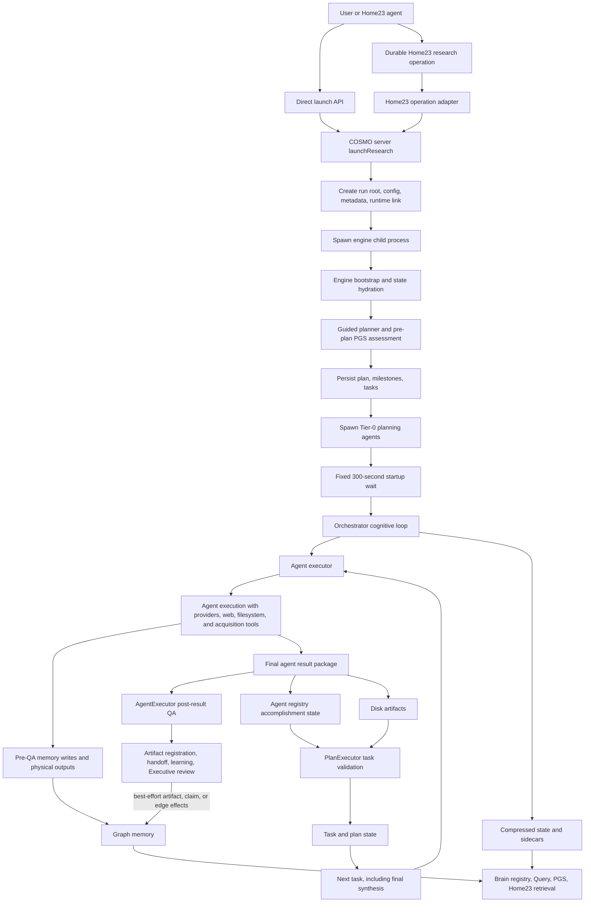
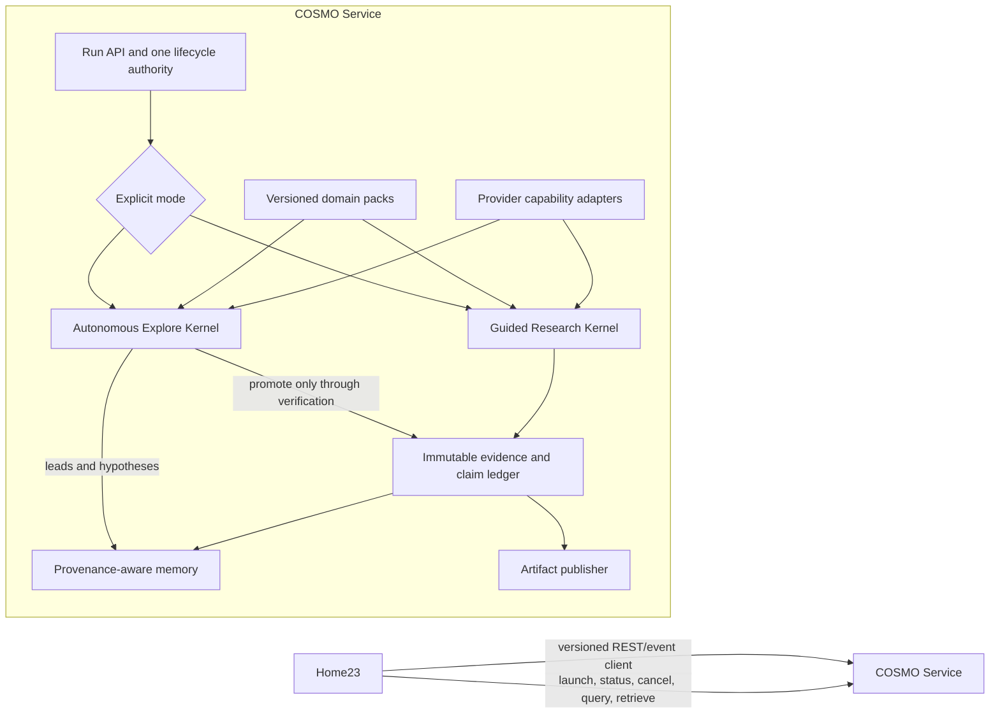

# COSMO Autonomous Research System Forensics

**Date:** 2026-07-29  
**Scope:** Original COSMO, COSMO Unified, standalone COSMO 2.3, historical run archives, `cosmos.evobrew.com`, and Home23-integrated COSMO23  
**Method:** Read-only source/history/run forensics plus bounded unit and lifecycle checks  
**Audit state:** Diagnosis complete; no production fix, process restart, run mutation, or historical-file mutation was performed

The source audit used Home23 HEAD `5ac824a8` plus the pre-existing dirty working tree. The live PM2 process was not restarted or proven to contain those uncommitted changes. The standalone repository is also heavily modified beyond its historical pre-Home23 head, so lineage claims are pinned to named commits; the June `jerryshows` tree is run evidence, not proof of clean `9b9f940` behavior. Statements about “current source,” historical commits, and observed runs are therefore kept distinct throughout.

## Executive verdict

COSMO should remain a product, but it should no longer be developed as a deeply embedded, directly edited Home23 subtree.

The recommended architecture is:

1. A separately versioned COSMO service/product owns research runs, engine state, evidence, artifacts, providers, migrations, and release acceptance.
2. Home23 uses a thin, versioned client adapter to launch, observe, cancel, query, and retrieve completed COSMO work.
3. COSMO explicitly separates:
   - **Autonomous exploration**, where curiosity, associative memory, role diversity, hypothesis generation, and long-running cognition are strengths.
   - **Auditable guided research**, where a single plan, deterministic evidence pipeline, claim-level provenance, and one closure authority are mandatory.

This is not a recommendation to discard the current Home23 code, blindly restore an old copy, or merely move today's `cosmo23/` directory elsewhere. The current tree contains valuable hardening; the old systems contain the strongest behavioral ideas; both also contain structural defects. The correct recovery is a controlled extraction and reconstruction, measured against preserved historical runs and a new cross-domain benchmark.

### The central diagnosis

There are three different truths, and treating any one of them as the whole explanation has caused repeated repair cycles:

- **COSMO had real original strengths.** It could sustain inquiry, generate useful connections, distribute work, build large corpora, and produce unusually insightful synthesis. The user's memory of a better system is supported by historical artifacts.
- **COSMO already had fundamental flaws outside Home23.** Its autonomous identity conflicted with guided research; completion was fail-open; source URLs were often treated as evidence without claim support; planner, coordinator, agents, memory, and artifact state regularly disagreed.
- **Home23 integration introduced additional regressions and obscured the old ones.** The imported subset was nearly exact, but the embedded tree then accumulated 214 COSMO-touching commits and more than 53,000 path-scoped insertions spanning runtime code, configuration, UI, tests, and docs, plus shared runtime/config/provider/brain-operation responsibilities, planner overfitting, Jerry-specific behavior in core research code, and new lifecycle seams.

The system now has more safety machinery but less coherent authority. It can reject an agent result as unfit for post-result integration while independently completing the task from the same rejected result or from any file found on disk. Memory and disk writes performed inside the agent may already exist before that QA decision. It can verify that a URL responded while assigning that URL to an unrelated synthesized claim. It can correctly block a bad run after spending more than one million tokens to create a 365-byte zero-document placeholder.

## What was inspected

### Source lineage

- Original COSMO repository: `/Volumes/Bertha - Data/_ALL_COZ/COSMO`
- COSMO Unified product repository: `/Users/jtr/websites/cosmos.evobrew.com`
- Standalone COSMO 2.3: `/Users/jtr/_JTR23_/cosmo_2.3`
- Home23-integrated COSMO23: `/Users/jtr/_JTR23_/release/home23/cosmo23`
- Additional historical source/build archives on:
  - `/Volumes/Althea`
  - `/Volumes/Bertha - Data`
  - `/Volumes/Casey Jones`

The mounted archives include original repositories, IP snapshots, `cosmoRuns`, `_Cosmo23_runs copy`, COSMO 2.3 builds, `Cosmo_Unified_dev`, website backups, and cursor exports. They were treated as evidence and not modified.

### Historical diagnosis documents

The audit cross-checked current behavior against prior self-investigations rather than assuming today's symptoms are new:

- `cosmo_2.3/investigations/cosmo-2.3-master-synthesis.md`
- `cosmos.evobrew.com/DERAILMENT_EXECUTIVE_BRIEF.md`
- `cosmos.evobrew.com/docs/COSMO_SYSTEM_ANALYSIS_AND_FIXES.md`
- `new_Coz copy/COSMO_WAS_RIGHT_ANALYSIS.md`
- `docs/design/STEP9-COSMO23-INTEGRATION-DESIGN.md`
- `docs/design/STEP24-OS-ENGINE-REDESIGN.md`
- `docs/design/COSMO23-VENDORED-PATCHES.md`

These documents repeatedly identified the same families of defects months before the latest failures: autonomous/guided conflict, coordinator timing blindness, stateless planning, duplicate agents, domain contamination, paths and tenant boundaries, artifact false-completion, no canonical closure, poor knowledge utilization, and simulation in place of observation.

### Run evidence

Representative runs were selected across eras. The audit did not use file count or a polished final document as a proxy for research quality. It scored:

- task fidelity
- source-to-claim binding
- source quality
- retrieval reproducibility
- coverage versus duplication
- handoff and synthesis use
- closure honesty
- time/token efficiency
- reader usefulness

## Lineage: what changed and when

### 1. Original COSMO, October 2025

The original repository begins at commit `79e5ec1` on 2025-10-12. Its identity was an always-running cognitive system:

- curiosity and intrinsic goals
- analyst/critic/explorer roles
- a graph memory
- campaigns and goal discovery
- sleep/dream behavior
- multi-agent execution
- an executive and meta-coordinator

The original strength was not conventional task automation. It was sustained autonomous cognition.

### 2. COSMO Unified, December 2025

`/Users/jtr/websites/cosmos.evobrew.com` begins with:

`1814176 Initial commit: COSMO Unified as standalone product`

Unified `engine/src/` is byte-identical by relative path to original COSMO `src/` at `1e90d4c`: all 198 compared paths match. Separate-repository timestamps do not establish copy direction. Multi-tenant, Watch, Explore, and IDE/product layers were then added in the Unified repository.

Historical January documentation already records:

- domain contamination
- path hardcoding and tenant leakage
- 213 agents where roughly 25 were expected
- event-log ambiguity
- task retry and synthesis loops
- artifact existence disagreeing with failure status
- unresolved tension between research forks and canonical artifact production

These are pre-Home23 defects.

### 3. Standalone COSMO 2.3, March-April 2026

The standalone repository starts at its own root commit, `ff5aeca3`. It is a selective snapshot or carve-out, not a demonstrated Git descendant of Unified. The closest compared source snapshot, `/Volumes/Casey Jones/Cosmo_Unified_dev` at `3056e484`, has 519 paths in common with that standalone root: 481 are byte-identical, 38 differ, 42 exist only in standalone, and 666 exist only in Unified.

The standalone lineage then added execution agents, continuation planning, PGS, provider expansion, ingestion, and interactive/product layers. Its historical pre-Home23 head was `9b9f940`; the present standalone worktree contains extensive later modifications and must not be treated as that commit.

The March 14 master synthesis is especially important. It concludes that guided mode had been retrofitted onto an engine whose founding axiom was that autonomous goals are sacred and should run even during guided work. In the `jgbhealth` run:

- 31 agents ran across four sessions.
- multiple agents independently found the same small set of facts.
- the coordinator interval was longer than agent lifetime and therefore saw zero active agents.
- the guided planner did not query the brain, completed findings, prior artifacts, or coordinator state.
- restarts generated new plans from the static task description.
- 381 memory nodes existed, but agents received only a small retrieval window.
- thousands of source URLs became a flat-file dead end.
- the tier handoff returned `null`.
- JSON evidence files were skipped by introspection.

The historical recommendation was already to make guided and autonomous execution genuinely separate.

### 4. The Home23 import, April 2026

Home23 first added `cosmo23/` at `3aea6643`.

Compared with standalone `9b9f940`, the Home23 import commit tracked:

- 682 paths were imported.
- 678 were byte-identical.
- the four differing blobs were `.env.example`, `lib/config-loader-sync.js`, `package.json`, and `package-lock.json`.
- zero Home-only paths.

Standalone `9b9f940` contained 2,305 tracked paths, so 1,623 were absent from the committed Home23 tree, mostly exports but also 32 engine paths, 16 investigations, 13 docs, and one run path. A contemporaneous integration note says approximately 2,289 files were copied at the filesystem level; ignored or generated files can reconcile that operational note with the smaller committed tree. The 678-of-682 match proves high fidelity among committed imported paths, not import completeness. It also does not prove runtime equivalence: package/config differences, environment projection, PM2 ownership, ports, working directory, untracked files, and paths absent from the commit can all change behavior without rewriting the matched engine blobs.

The imported planner already contained an active Jerry/Jerrybase example, and the imported tree contained Jerry Health fixtures. What it did not yet contain were the executable spine ontology, Lost Live Dead/JGMF repair logic, `inferJerryProject`, or the later forum/social artifact machinery. Home23-era development escalated example- and fixture-level domain bias into executable routing, ranking, classification, and rejection behavior.

The approved Step 9 integration design explicitly said:

> COSMO 2.3 is a dependency, not a fork. Its internals stay untouched.

It also constrained Home23 to credentials, ports, process monitoring, launch/status/search, and separate research brains. That clean boundary did not survive.

### 5. Post-import mutation

From `3aea6643` to audited HEAD `5ac824a8`:

- 214 commits touched `cosmo23/`.
- 268 COSMO files changed.
- the path-scoped diffstat contains 53,307 gross insertions and 3,971 gross deletions, a net increase of 49,336 lines.

The 214 commits include four merges plus documentation, tests, UI, configuration, and chores; the diffstat is not a claim that 53,307 runtime lines were added.

The embedded dependency became a first-class, directly edited subsystem connected to:

- Home23 provider and OAuth configuration
- PM2/service startup
- shared brain registries and memory-source adapters
- Query and PGS operations
- durable research operation workers
- source pinning and capability ownership
- artifact projection and requester output
- Home23 tests and CLI lifecycle
- Evobrew brain discovery

On July 21, the approved parity-program design made this ownership change explicit: `cosmo23/` became a first-class editable Home23 engine, upstream resynchronization was accepted as dead, and COSMO updates were assigned to `home23 update`. That was a rational response to urgent persistence defects and the cost of maintaining surgical compatibility patches. It also formally removed the independent product boundary. The recommendation in this audit is therefore a deliberate new architecture decision based on cross-era evidence, not a claim that recent work accidentally violated the then-current doctrine.

Not all of that growth was damage. The July parity program added real persistence integrity, crash recovery, heartbeat and wedge recovery, graph-performance work, spend metering, and park/resume governance. Its live receipts also caught two composition bugs that green unit fixtures missed. That is evidence of both valuable hardening and the risk of moving many Home23 engine mechanisms into COSMO at once. These improvements protect continuity; they do not repair claim provenance, handoff, or closure authority.

The issue is therefore not directory location by itself. It is the disappearance of a release and ownership boundary.

### Inherited defects versus Home23-era seams

Present at initial import `3aea6643`:

- PGS assessment before planning and before the first full state save
- the fixed 300-second startup drain
- BaseAgent's `complete` event before final accomplishment packaging
- independent QA/integration and PlanExecutor closure authorities
- PlanExecutor disk rescue
- launch acceptance based on child-process spawn rather than research readiness

Added or materially reshaped after import:

- owned run roots, aliases, and durable Home23 research-operation records
- continuation/local-spine fallback in `6e12cfde`
- Jerry-specific core behavior in `403d42b9`
- source contracts, typed routes, receipts, source pins, and artifact gates
- the July 29 persistence/accomplishment mismatch around `5ac824a8` and the current uncommitted ResearchAgent bridge

## Cross-era run matrix

Scores are 0-5. `T` task fidelity, `B` claim binding, `Q` source quality, `R` reproducibility, `C` coverage without duplication, `H` handoff/synthesis, `O` closure honesty, `E` efficiency, and `U` usefulness.

| Era and run | T | B | Q | R | C | H | O | E | U | Forensic conclusion |
|---|---:|---:|---:|---:|---:|---:|---:|---:|---:|---|
| 2025-10-12 deep-code self-audit | 4 | 2 | 5 | 3 | 3 | 2 | 3 | 1 | 4 | Genuinely insightful local-code analysis; a separate post-run fact-check rated it 8.5/10 within scope, but it lacked a modern evidence/closure chain |
| 2025-12-27 `Autoscombo2` | 4 | 3 | 5 | 3 | 2 | 3 | 1 | 2 | 5 | Excellent source pool and prose; plan stayed active and 2,249 of 5,449 non-marker output files shared exact hashes, a 41.3% duplicate-file rate |
| 2026-02-16 `JerryG` | 3 | 1 | 3 | 3 | 4 | 4 | 1 | 3 | 4 | Broad, useful corpus; final had no URLs and the plan claimed completion while 96 current and 15 archived task files still said `PENDING` |
| 2026-06-02 standalone `jerryshows` | 4 | 3 | 4 | 4 | 5 | 3 | 4 | ? | 4 | Strongest evidenced outside-Home23 guided result; coherent domain deliverable and validator, but likely restored/carried state makes timing invalid, its synthesis manifest stayed pending integration, and final citation weakened |
| 2026-06-24 Home23 distributed-agent run | 1 | 0 | 0 | 1 | 1 | 1 | 3 | 0 | 1 | Earliest clear integrated degradation in the inspected run sample; 40 cycles and roughly an hour produced one 365-byte output |
| 2026-06-30 controlled Home23 acceptance | 5 | 5 | 4 | 5 | 5 | 4 | 5 | 4 | 4 | Best narrow receipt/closure run, but harnessed; its final manifest remained noncanonical and pending integration, and its validator did not test general prose entailment |
| 2026-07-29 Home23 MIDI continuation | 0 | 0 | 0 | 2 | 0 | 0 | 5 | 0 | 0 | Honest block after empty artifact handoff; 1,055,655 tokens and 494 calls for a 365-byte placeholder |
| 2026-07-29 Home23 health run | 2 | 2 | 2 | 4 | 3 | 2 | 4 | 1 | 2 | Better source instrumentation; the registry contained 30 canonical-claim entries, 296 source references, and zero evidence references, and no top-level final synthesis was produced |

### What the matrix proves

1. There is no single historical build that is both the most creative and an adequate factual gold standard.
2. The user's experience of the standalone system being better is supported by usefulness, coherence, corpus generation, and sustained research behavior.
3. Earlier completion signals were often optimistic or false. Newer honest blocking can make the system feel worse even when it is correctly exposing an old defect.
4. Home23 degradation predates recent Terra or MiniMax provider changes. It appears in a June 24 GPT-5.5 run, so provider choice changes failure shape and cost but is not the root cause.
5. The June 30 acceptance run proves that the integrated stack can satisfy a narrow evidence contract. It does not prove the autonomous research system works across domains.

### Best preserved baselines

No one run should be crowned the baseline. Use three:

- **Standalone `jerryshows`** for coherent domain execution and deliverable behavior, excluding its non-comparable timing, which strongly indicates restored/carried state or reset creation metadata.
- **`Autoscombo2`** for large, diverse, high-quality source collection and reader usefulness, with closure and duplication treated as failures.
- **June 30 controlled acceptance** for exact receipt, route, source-body, and closure semantics.

Use `JerryG` as a broad-corpus regression case, not as a truth or completion standard.

## Current end-to-end lifecycle



The diagram looks linear, but the current system is not governed by one state machine. Launch operation state, research record state, child process state, registry state, QA state, task state, progress state, artifact state, memory state, and physical disk state are separate authorities.

## Layer-by-layer findings

### Layer 1: Product identity

**Finding:** COSMO is simultaneously an autonomous cognitive organism, a guided research manager, a data pipeline, an artifact builder, a graph database, a provider broker, and a Home23 brain service.

The original autonomy model rewards continuation, novelty, and new goals. Guided research requires bounded scope, source discipline, convergence, and termination. Those objectives cannot share the same fallback behavior and closure semantics.

**Effect:** An autonomous mechanism that is a feature in Explore mode becomes duplication and drift in a guided run. A fail-closed evidence gate that is correct for research can suppress useful exploratory hypotheses if both modes share one result type.

### Layer 2: Home23 service boundary

**Original contract:** Home23 should manage the server, credentials, ports, monitoring, and a research client while COSMO owns its internals.

**Current reality:** Home23 directly imports COSMO memory, registry, Query, PGS, operation, provider, and artifact modules. COSMO also serves as an OAuth broker and shared brain-operation backend.

**Effect:** A COSMO engine change can break Home23 Query or provider behavior; a Home23 ownership or path change can alter research execution. There is no independent release, rollback, compatibility, or acceptance boundary.

### Layer 3: Launch and operation ownership

There are two launch surfaces:

- direct `/api/launch`
- durable Home23 `research_launch`

The durable operation becomes `complete` when launch is accepted, while the research record becomes `active`. The adapter has no natural completion writer. On normal COSMO child exit, the server clears `activeContext` before adapter refresh can match it.

**Observed effect:**

- stale `active` research records
- 13 persisted Home23 launch records remained in `state:"starting"` on 2026-07-29, with no corresponding active launch observed
- a control-plane “complete” that means “accepted for launch,” not “research complete”

### Layer 4: Run roots, config, and process topology

Home23 adds run-root ownership, aliases/symlinks, managed config, provider catalogs, environment projection, ports, PM2 state, and requester output roots.

At least one launch seam ignores a `{success:false}` helper result, so the engine can continue against the actual run path after an alias/config-link failure.

**Effect:** A run can exist physically but be undiscoverable through the expected owner/root, or start with a different config surface from the one Home23 believes it prepared.

### Layer 5: Bootstrap and timing

The engine performs a planning assessment before the first full state save. A missing `state.json.gz` during this exact startup sequence is therefore expected, not itself proof of corruption.

The larger defect is timing:

- startup waits 300 seconds for planning agents
- configured agents are allowed 15, 20, 30, or 60 minutes
- PlanExecutor uses a separate 12-minute watchdog
- timeout of the startup wait logs and proceeds; it does not cancel the agents

**Effect:** The cognitive loop and PlanExecutor can begin while planning agents continue running. Late results can arrive into a later lifecycle phase. The same mission is observed under multiple clocks and owners.

### Layer 6: Planning

The planner now has valuable continuation context and research-digest machinery, but it also contains global semantic fallbacks introduced for particular investigations.

When it classifies context as usable—no explicit task plan or redirect, plus a thread/context anchor, usable assessment, or local artifacts—and no targeted-web condition applies, current main sets `webPolicy: none`. Its evidence mode is `local_sufficient` when local artifacts exist and `local_gap` otherwise. Detected external gaps select mixed/targeted research only when web is available and the user did not explicitly request no web.

The following project-specific vocabulary appears in the narrower branch where the model returns zero missions for a local continuation; targeted and broad zero-mission branches use different defaults. That local fallback requires:

- Verdict
- Spine
- Facet Buckets
- Artifact Buckets
- “localizable substrate”
- “transferable activation”
- “dissociation evidence”
- a five-move spine

This vocabulary came from one pressure-test/classification task and is not a general research ontology.

**Direct reproduction:** Two HNSW-versus-IVF runs were converted into local document analysis with no documents. Each produced a 365-byte “Analyzed 0 documents” report instead of conducting external technical research.

### Layer 7: Domain integrity

The core `ResearchAgent` contains executable Jerry-specific behavior:

- hardcoded Lost Live Dead and JGMF URLs
- Jerry Garcia Band, Legion of Mary, Old & In the Way, Reconstruction, and NRPS queries
- Jerry project classification
- forum/blog/recollection source typing and confidence behavior

The hardcoded query list is guarded by Jerry/project terms; the audit did not show unrelated missions receiving those exact Jerry queries. The cross-domain defect is subtler and still structural: generic forum/social candidate construction can reject results whose inferred Jerry project is `unknown`, starving a non-Jerry mission inside a universal research agent.

Commit lineage:

- `6e12cfde` was mixed: it introduced the pressure-test/spine fallback only for a zero-mission branch with local context, while also adding useful thread arbitration, evidence policy, and replay-queue work.
- `52f69230` added show/forum/anecdote-skewed behavior conditionally when secondary or forum sources were preferred, alongside generic fixes.
- `60f50af8` established the global raw-anecdotes inventory and acceptance semantics; `f053bd7a` added archive-validation behavior.
- `403d42b9` deepened that machinery and added Jerry-specific query, matching, ranking, classification, and forum-candidate behavior, alongside generic hardening.
- `3677d622` armed previously implemented, default-off memory shaping, garbage collection, sleep, spend, and starvation gates in new active Home run configuration; it did not introduce those mechanisms or rewrite existing and standalone configurations. Its four-cycle, 22-node acceptance proof could not exercise 5,000/10,000-node or 14-day gates. The same commit separately fixed the Ollama-cloud `maxTokens`/`maxOutputTokens` alias.

**Effect:** A universal research path contains a Jerry-only classification gate that can break generic extraction. Domain-pack semantics have leaked into the kernel even though the exact Jerry query rewrite is guarded.

### Layer 8: Agent mission and tool capability

Planner-selected role names are not proof that the corresponding agent can execute the mission.

Observed:

- an ExplorationAgent was assigned a local file inventory but explicitly reported having no filesystem tool
- DocumentAnalysisAgents received `artifactInputs:[]` for missions naming `@outputs/`
- ResearchAgents wrote approximately ten files each while lifecycle accounting recorded zero persisted files
- the on-disk accomplishment requirement was added after import at `5ac824a8`; its generic counter did not see every custom writer
- the current uncommitted bridge addresses ResearchAgent output accounting only
- ordinary Synthesis writes its report to memory and returns `reportGenerated` without a generic persisted-file receipt, while final-deliverable Synthesis writes a file and manifest directly without incrementing the generic persistence counter

**Effect:** A logically correct plan can fail at the role/tool/input boundary. New Home23-era truth hardening can then reject real files because older custom writers do not publish the counters it expects. The system interprets either mismatch as an agent-quality or provider problem.

### Layer 9: Provider and model routing

Historical and current logs show:

- expired OAuth tokens
- unsupported system-message requests
- context and sampling incompatibilities
- output-token/catalog mismatches
- different provider tool protocols
- large differences in cost and latency

These are real defects, but not the root cause. The integrated failure appears under GPT-5.5 before the later Terra/MiniMax runs. Provider choice controls how an architectural defect manifests:

- one model may return malformed planning JSON and trigger the bad fallback
- another may spend hundreds of calls trying to satisfy an impossible mission
- another may fail early on a request-shape mismatch

Provider abstraction must be tested, but changing models cannot repair lifecycle authority, handoff, or claim provenance.

### Layer 10: Retrieval and acquisition

The current system has materially improved source controls:

- typed research contracts
- planned versus executed queries
- source attempts
- HTTP crossings
- content hashes and bytes
- route requirements
- raw output persistence
- source manifests

But acquisition is still split between overlapping paths:

- ResearchAgent search/provider/direct-URL paths
- DataAcquisition agents
- archive metadata/review routes
- Home23 source providers

The paths produce different evidence shapes and not all feed raw page content into synthesis.

Observed route mismatch:

- eight measured successful sources existed
- the run failed `missing_required_source_routes`
- a broad Archive.org regex required advanced-search, metadata, and review route IDs
- raw HTTP receipts were real but did not satisfy those typed route names

**Effect:** A run can have useful evidence and fail a syntactic route contract, or pass source-count requirements without proving claim support.

### Layer 11: Evidence and provenance

This is the most serious research-quality defect.

Current `buildExtractionReceipts()`:

1. collects “productive” URLs
2. loops over synthesized findings
3. assigns each finding the next URL round-robin
4. marks it `accepted`
5. assigns confidence `0.7`

It does not test whether the source contains, entails, contradicts, or even discusses the claim.

**Direct artifact proof:** In the July semantic-search proof run, NIST post-quantum cryptography claims and IEA energy claims were marked accepted against World Economic Forum Global Risks URLs. The claim text itself named different NIST or IEA sources; the receipt `source_url` did not support it.

This is source theater in a stricter format:

- HTTP response is not extraction.
- extraction is not claim support.
- a list of URLs is not a bibliography.
- a bibliography is not provenance.
- a model mentioning a URL is not proof it read the page.

### Layer 12: Synthesis

Historical synthesis was often COSMO's strongest visible feature. It also systematically weakened provenance:

- `JerryG` accumulated thousands of URLs but the final had none.
- standalone `jerryshows` built a substantial dataset and source manifest, but the expanded top-level report retained zero direct URLs.
- provider-native research can synthesize provider summaries rather than captured raw bodies.
- local search paths can synthesize titles/URLs/snippets rather than page content.
- direct-URL paths can pass validation metadata rather than the relevant passage.
- training-knowledge fallback remains available when the mission is not classified as source-required.

**Effect:** Strong prose can outrun the evidence that was actually acquired.

### Layer 13: QA, accomplishment, and closure

There is no single completion authority.

Current cycle order:

1. An agent may write graph memory and physical files while it is still executing.
2. AgentExecutor later processes the result and runs post-result QA.
3. An accepted result enters artifact registration, handoff, learning, and Executive-review paths; a rejected result is marked processed but its earlier memory or disk writes are not rolled back.
4. PlanExecutor independently reads agent registry accomplishment.
5. PlanExecutor independently reads raw agent results and scans disk.

A bounded in-process reproduction constructed:

- status `completed`
- accomplishment `true`
- one placeholder deliverable
- no finding or insight
- acceptance criterion “Claims must be supported by sources”

Against the current dirty working tree, the result was:

- AgentExecutor QA rejected it.
- PlanExecutor returned `TASK_COMPLETED`.
- PlanExecutor queued `COMPLETE_TASK` using the placeholder.

At committed HEAD `5ac824a8`, the same no-findings shape is instead accepted by QA at confidence `0.8`. The current uncommitted QA hardening changes that one decision, but does not change PlanExecutor's separate authority. The reproduction therefore proves the current source-level split, not the exact behavior of the running PM2 process.

The code explicitly says that, once any artifact exists, acceptance criteria are accepted “for now.” Disk rescue can also complete a task after an unaccomplished or failed agent. QA rejection does not undo memory or file effects already produced inside the agent.

This split existed at initial import. Home23 did not invent it, but later truth gates made its contradictions more visible.

### Layer 14: Persistence and memory

State exists in several representations:

- compressed `state.json.gz`
- graph sidecars and manifests
- ClusterStateStore plan/task/milestone files
- agent registry
- results queue/history
- artifact registry
- physical output files
- Home23 research-run records
- progress markdown

Observed:

- in the recorded July 29 `research-brop_vQR8HGD11xCRK7akIgmLLnTiPmxiUDYe` run, physical ResearchAgent output existed while its result recorded `persistedFiles:0`
- inline state said zero nodes while the authoritative memory manifest had 129 nodes and 1,149 edges
- progress said complete while tasks remained pending
- local-artifact missions named output locations while handoff metadata sometimes supplied no artifact inputs
- first state save occurs only after the first settled cycle or bounded shutdown

**Effect:** “Zero,” “complete,” “active,” and “missing” are statements about one projection, not system truth.

### Layer 15: Query and brain reuse

Home23 has invested heavily in pinned Query/PGS operations, memory-source ownership, safe projections, cancellation, sidecars, and durable operation receipts. That machinery is valuable for completed corpora.

It is not a substitute for research validity. Query can faithfully retrieve a graph node that was synthesized from an unsupported claim. PGS improves graph coverage, not epistemic quality.

Memory must be treated as:

- a lead and context store by default
- evidence only when its provenance resolves to an immutable source capture and exact extraction

### Layer 16: Observability and economics

The system exposes many metrics but lacks a single reader-facing research truth record.

Representative costs:

- one Home23 continuation: 1,055,655 tokens, 494 calls, one 365-byte placeholder
- one health run: 286,166 tokens, 38 calls, 79 artifacts, no top-level final synthesis
- another recent run: 5,156,950 tokens for an authoritative graph of only 14 nodes and 45 edges

Historical run counters are not always comparable; the standalone `jerryshows` state reports 4,054 cycles in roughly 76 seconds, strongly indicating restored/carried state or reset creation metadata rather than 4,054 newly executed cycles.

Useful metrics must be tied to outcomes:

- supported claims per 100k tokens
- unique accepted evidence passages per call
- duplicate mission and artifact rate
- closure precision
- restart equivalence
- time to first verified claim
- time to accepted final

### Layer 17: Tests and acceptance

The current repository has extensive unit and contract coverage. Fresh bounded verification of the exact audited working tree produced:

- 232 passes and 1 failure across the selected COSMO engine planning, orchestration, agent, output-contract, handoff, and research-contract suites
- 66 passes and 2 failures across the selected Home23/COSMO output-truth, Anthropic request, brain-router, source-pin, and model-catalog suites

Some uncommitted truth-gate, Anthropic request, and source-pin tests passed. The failures included a stale research-contract expectation and model-catalog coverage.

The more important finding is qualitative:

- a planner test explicitly expects local continuation/no-web behavior
- a research test explicitly expects Jerry side-project query rewriting

Tests are preserving behaviors that are regressions outside their original domains.

The missing level is cross-domain end-to-end acceptance using fixed tasks, evidence, expected claims, restart scenarios, provider pairs, and cost ceilings.

## Root-cause hierarchy

### Root cause 1: One engine contains two incompatible products

Autonomous exploration and auditable guided research share cognition, fallbacks, agents, memory, and closure. This is the oldest and deepest flaw.

### Root cause 2: There is no single authoritative research state machine

Agent status, accomplishment, QA, task state, plan state, progress, memory integration, disk existence, child-process state, and Home23 operation state can independently declare success or failure.

### Root cause 3: Evidence is metadata attached after synthesis, not the substrate of synthesis

The system records URLs and crossings but does not require each factual claim to be derived from an exact captured passage with a stable locator and entailment decision.

### Root cause 4: The Home23 dependency boundary collapsed

The initially near-identical imported subset became a shared implementation surface with 214 COSMO commits and many internal imports. Integration regressions are now difficult to isolate from engine changes.

### Root cause 5: One-off successful fixes became global semantics

Pressure-test terminology, show/anecdote sourcing, Jerry-specific routes, and memory-shaping policies were added to core code and protected by narrow tests without cross-domain acceptance.

### Root cause 6: Activity is easier to measure than research progress

Cycles, agents, URLs, files, nodes, calls, and completed subprocesses can all rise while accepted claims, useful handoffs, and final deliverables remain zero.

### Root cause 7: Provider failures amplify, but do not cause, the architecture

Models expose different branches of the same weak contracts. Changing a provider moves the symptom.

## What must be preserved

COSMO should not be reduced to a conventional single-agent search pipeline. Its unusual strengths are the reason to recover it:

- long-horizon autonomous curiosity
- broad, parallel exploration
- diverse cognitive roles
- associative graph memory
- cross-source and cross-domain connection making
- productive self-analysis
- the ability to generate novel follow-up questions
- corpus building
- strong synthesis when the evidence substrate is real
- independent operation over hours or days

The October code audit demonstrates authentic self-analysis. `Autoscombo2` demonstrates corpus scale and useful synthesis. `jerryshows` demonstrates that a standalone guided run can coordinate a complex data deliverable. These are not accidents to discard.

The recovery architecture must make curiosity safer and more useful, not remove it.

## What should not be done

### Do not keep repairing only the current Home23 subtree

That preserves the missing product boundary and makes each fix participate in Home23's provider, brain, CLI, OAuth, and runtime contracts.

### Do not copy the current `cosmo23/` directory to a new location and call it standalone

That moves the same authority, evidence, and domain-contamination flaws.

### Do not wholesale-revert to an old “good” build

That restores productivity and false completion together. Historical runs prove the old system could be impressive while hiding pending tasks, duplication, or weak source binding.

### Do not choose a new provider as the primary repair

Provider compatibility requires work, but failure predates the latest provider changes.

### Do not use one successful Jerry run as release acceptance

This is how domain-specific semantics entered the kernel. Jerry should be a benchmark and a versioned domain pack, not the universal planner.

### Do not equate unit-test volume with autonomous-research acceptance

Many unit tests can consistently protect the wrong behavior.

## Recommended target architecture



### Boundary rules

COSMO owns:

- engine source and releases
- run state and migrations
- model/provider capability negotiation
- prompts and role contracts
- raw source captures
- evidence and claim ledger
- artifacts and research brains
- run events, cancellation, resume, and closure
- benchmark acceptance

Home23 owns:

- user/agent identity
- optional provider credential delegation
- launch/status/cancel/query UI and tools
- notification and artifact presentation
- access policy

Home23 must not:

- import COSMO engine internals
- mutate COSMO run state directly
- infer run completion from process exit or launch acceptance
- scan arbitrary COSMO files as an alternative to the API contract

COSMO can still ship as an optional local service in the Home23 installer. “Separate” means separate authority, release, state, and API—not necessarily a remote cloud dependency.

## Internal COSMO architecture

### Mode A: Autonomous Explore

Purpose:

- discover questions
- generate hypotheses
- connect distant evidence
- identify anomalies and gaps
- grow a lead graph
- publish promising investigations

Rules:

- outputs default to `lead`, `hypothesis`, or `interpretation`, not `fact`
- memory can inspire new work but cannot silently become external evidence
- autonomous goals have budgets and termination contracts
- critic outputs require structured verdicts
- publication cadence and dedupe are enforced
- promotion to a factual claim uses the same evidence pipeline as guided research

### Mode B: Guided Research

Purpose:

- answer a bounded question
- produce a specified deliverable
- make source-supported claims
- stop honestly

Rules:

- no autonomous goal discovery in parallel
- planner receives accepted claims, completed artifacts, gaps, and current assignments
- parallel missions are non-overlapping by source or sub-question
- one state machine owns task and run completion
- synthesis cannot read unsupported model prose as evidence
- a partial or blocked result is a valid terminal outcome

## One authoritative lifecycle

Recommended run states:

```text
CREATED
  -> PLANNED
  -> ACQUIRING
  -> EXTRACTING
  -> VERIFYING
  -> SYNTHESIZING
  -> QA
  -> COMPLETE | PARTIAL | BLOCKED | FAILED | CANCELED
```

Rules:

- Agent completion is an event, never task completion authority.
- File existence is an artifact fact, never acceptance proof.
- QA owns transition out of `QA`.
- Process exit reconciles state; it does not choose the terminal outcome.
- Launch-operation completion means only launch acknowledgement and must use a distinct name such as `accepted`.
- Every transition is append-only, idempotent, and replayable.
- Every projection—UI, progress markdown, registry, and Home23—is derived from the same event ledger.

## Evidence model

The minimum durable entities are:

### `SourceCapture`

- canonical URL or local source ID
- retrieval route
- retrieved timestamp
- HTTP/status and content type
- raw bytes or immutable local object reference
- content hash
- title/author/date when actually extracted
- access limitation or failure

### `Extraction`

- source capture ID
- exact passage or structured record
- page, paragraph, timestamp, selector, or row locator
- extraction method and model/tool version
- normalized text hash

### `Claim`

- atomic claim text
- extraction IDs supporting it
- extraction IDs contradicting it
- source-quality assessment
- entailment verdict
- confidence with explicit calculation
- status: proposed, supported, disputed, unsupported, superseded

### `SynthesisStatement`

- final prose span
- claim IDs used
- inference label when it goes beyond direct support

A receipt is accepted only when its cited extraction supports its claim. Round-robin URL assignment is impossible in this model.

## Domain packs

Jerry-specific expertise is valuable and should be preserved in a versioned pack:

- preferred archives
- source-quality rules
- entity vocabulary
- date/band normalization
- query templates
- archive identifiers
- known ambiguity rules
- expected output schemas

The pack is selected explicitly by the run. Core research code must have zero Jerry, show, venue, or band-specific branches.

Create equivalent packs for:

- local code/repository analysis
- historical biography
- scientific literature
- current technical research
- structured web data

Cross-domain tests must prove that selecting no pack produces no pack-specific behavior.

## Recovery program

### Stage 0: Preserve, freeze, and name the evidence

Do before architectural edits:

- preserve the original COSMO repository and tags
- preserve standalone `cosmo_2.3`, including dirty state
- preserve the audited Home23 tree and dirty changes
- snapshot the selected historical run directories
- record run code/config/provider identity where recoverable
- freeze new semantic behavior in the embedded kernel except urgent safety fixes

Exit criterion:

- every selected baseline can be hashed and replayed or inspected without dependence on a mutable symlink

### Stage 1: Build the cross-domain acceptance harness

Create fixed tasks:

1. Local code audit with known ground truth.
2. Historical factual research with a seeded source packet and hidden claim checks.
3. Open-web technical research.
4. Structured data acquisition and database build.
5. Continuation with real local artifacts.
6. Continuation with zero artifacts.
7. Restart/resume midway through acquisition.
8. Provider failure and source outage.
9. An unrelated topic that detects Jerry/domain leakage.
10. Autonomous exploration judged on novelty, dedupe, promotion precision, and published usefulness.

Score:

- claim-source entailment precision
- supported-claim recall
- source quality
- duplicate mission/artifact rate
- handoff utilization
- task and closure precision
- restart equivalence
- time and tokens to verified output
- final reader usefulness

Exit criterion:

- historical baselines and current Home23 can run through the same evaluator, even if some require offline artifact scoring rather than replay

### Stage 2: Re-establish a separate COSMO repository and service contract

Use the standalone lineage as the ancestry and behavioral donor, not as an assumed-correct implementation.

Inputs:

- pre-Home23 standalone head `9b9f940`
- original autonomous engine/tag history
- the standalone `jerryshows` behavior
- current Home23 truth-hardening patches
- controlled June 30 receipt semantics

Do not import current Home23 integration modules wholesale. Port behavior only after its benchmark proves value.

Exit criterion:

- Home23 can launch/status/cancel/retrieve a no-op research run through a versioned API without importing COSMO internals

### Stage 3: Repair the truth core

In order:

1. one lifecycle/event authority
2. immutable source capture
3. exact extraction and claim ledger
4. synthesis from accepted claims
5. QA-owned closure
6. truthful partial/blocked terminal states
7. provider capability negotiation
8. restart/replay equivalence

Exit criterion:

- no test can make QA reject a result while the task completes from that result
- no accepted claim can exist without a supporting extraction

### Stage 4: Restore COSMO's autonomous intelligence

Bring back:

- curiosity
- multi-role exploration
- associative memory
- meta-coordination
- hypothesis generation
- long-running campaigns
- self-analysis

But make promotion into factual research cross the evidence gate.

Exit criterion:

- autonomous runs generate novel, non-duplicate leads and publish useful artifacts without silently upgrading hypotheses into facts

### Stage 5: Build the Home23 adapter and shadow-run

For a period, send the same benchmark tasks to:

- current embedded COSMO23
- extracted COSMO service

Compare outputs automatically and review the most important runs manually.

Exit criterion:

- extracted COSMO beats the selected historical baselines on truth/closure while preserving their usefulness and autonomous strengths

### Stage 6: Cut over carefully

Only after acceptance:

- Home23 switches its research tool to the service API
- historical brains remain queryable
- current embedded COSMO becomes read-only compatibility/migration code
- rollback keeps the old service and run data intact

## Immediate priorities

### P0: Stop diagnostic drift

- Treat this report and selected runs as the baseline.
- Do not apply another domain-specific planner fallback.
- Do not call a run fixed based on `/api/status`, one query, file existence, or a narrow unit test.

### P0: Establish the service decision

Adopt the separate-service/thin-adapter direction before more engine work. Otherwise every engine fix will continue to expand Home23 coupling.

### P0: Build the evaluator before the rewrite

Without it, “better” will keep meaning whichever run most recently looked impressive.

### P1: Fix closure authority and claim binding first

These are the two defects that make every other metric unreliable.

### P1: Remove semantic contamination from core

Move Jerry/show/anecdote/pressure-test behaviors into explicit packs or delete them after benchmark comparison.

### P1: Unify output and handoff contracts

Every agent writes through one artifact API. Planner missions declare required inputs and capabilities. A mission cannot launch if the selected role lacks them.

### P2: Rationalize provider support

Record capability matrices per model pair:

- system/developer message support
- tool protocol
- structured output
- context limit
- max output
- sampling options
- OAuth/API-key authority

Fail before launch when the requested mission is incompatible.

### P2: Migrate completed brains through provenance-aware compatibility

Historical nodes without claim-level provenance remain useful as leads. Label them `legacy_unverified`; do not discard them and do not present them as verified.

## Acceptance standard for “COSMO is back”

COSMO is not back merely when it runs for hours, spins up many agents, creates a large graph, or writes an impressive report.

It is back when:

1. Autonomous mode produces novel, useful, non-duplicate leads over long horizons.
2. Guided mode stays on the user task.
3. Every factual final claim resolves to exact captured evidence.
4. Unsupported inference is visibly labeled.
5. Parallel agents cover non-overlapping work and use each other's outputs.
6. Restarted runs continue rather than regenerate.
7. QA is the only completion authority.
8. Partial and blocked results are honest and useful.
9. Provider changes do not change semantics.
10. Home23 can upgrade or roll back independently from COSMO.
11. Jerry research excels because a Jerry pack is selected, not because Jerry is embedded in the universal kernel.
12. It meets or beats the best historical runs on usefulness without inheriting their false-completion behavior.

## Evidence anchors

### Current source

- Initial integration contract: `docs/design/STEP9-COSMO23-INTEGRATION-DESIGN.md:12-14, 38-81, 178-185`
- Earlier architectural self-diagnosis: `docs/design/STEP24-OS-ENGINE-REDESIGN.md:7-54`
- Fixed startup wait: `cosmo23/engine/src/index.js:114-199, 833-841`
- Agent timeout ranges: `cosmo23/engine/src/config/agent-timeouts.js:14-44`
- QA rejection and processed marking: `cosmo23/engine/src/agents/agent-executor.js:670-900`
- QA then PlanExecutor cycle order: `cosmo23/engine/src/core/orchestrator.js:1803-1862`
- Registry-based task completion: `cosmo23/engine/src/core/plan-executor.js:711-753`
- Disk rescue and artifact-only acceptance: `cosmo23/engine/src/core/plan-executor.js:1020-1328`
- Local/no-web planning policy: `cosmo23/engine/src/core/guided-mode-planner.js:1930-1983`
- Pressure-test fallback in global planner: `cosmo23/engine/src/core/guided-mode-planner.js:2998-3086`
- Jerry-specific core queries: `cosmo23/engine/src/agents/research-agent.js:635-662`
- Jerry-specific candidate rejection and classification: `cosmo23/engine/src/agents/research-agent.js:3178-3225, 3287-3296`
- Round-robin extraction receipts: `cosmo23/engine/src/agents/research-agent.js:2954-2976`
- First-class editable doctrine: `docs/superpowers/specs/2026-07-21-cosmo23-parity-program-design.md:27-40`
- Recent persistence, liveness, graph, and governance proofs: `docs/receipts/2026-07-22-cosmo23-phase1-live-proof.md`, `docs/receipts/2026-07-22-cosmo23-phase2-live-proof.md`, `docs/receipts/2026-07-22-cosmo23-phase3-4-live-proof.md`

### Historical reports

- `/Users/jtr/_JTR23_/cosmo_2.3/investigations/cosmo-2.3-master-synthesis.md`
- `/Users/jtr/websites/cosmos.evobrew.com/DERAILMENT_EXECUTIVE_BRIEF.md`
- `/Users/jtr/websites/cosmos.evobrew.com/docs/COSMO_SYSTEM_ANALYSIS_AND_FIXES.md`
- `/Volumes/Bertha - Data/_ALL_COZ/new_Coz copy/COSMO_WAS_RIGHT_ANALYSIS.md`

### Representative runs

- `/Volumes/Bertha - Data/_ALL_COZ/new_Coz copy/cosmo_backup_deep_code_analysis_20251012_110141_20251012_110141`
- `/Volumes/Bertha - Data/_ALL_COZ/COSMO/runs/Autoscombo2`
- `/Users/jtr/websites/cosmos.evobrew.com/data/users/cmjtizyn80000aulpahd0pfk5/runs/JerryG`
- `/Users/jtr/_JTR23_/cosmo_2.3/runs/jerryshows`
- `/Users/jtr/_JTR23_/release/home23/instances/jerry/workspace/research-runs/distributed-autonomous-agent-architectures-state-20260624030034`
- `/Users/jtr/_JTR23_/release/home23/cosmo23/runs/cosmo23-acceptance-archive-reviews-closeout-20260630215506`
- `/Users/jtr/_JTR23_/release/home23/instances/jerry/workspace/research-runs/research-brop_QILor-nJIDsYhDo8wriE5PGowqTmhGS6`
- `/Users/jtr/_JTR23_/release/home23/instances/jerry/workspace/research-runs/research-brop_vQR8HGD11xCRK7akIgmLLnTiPmxiUDYe`
- `cosmo23/runs/concise-practical-tradeoffs-between-hnsw-and-ivf-vector-index-types-for-semantic-search`
- `cosmo23/runs/phase1-live-proof-round-2-practical-overview-of-cosine-similarity-for-semantic-search`

## Final conclusion

COSMO did not fail because its founding idea was wrong. It failed because its most original idea—an autonomous, curious, persistent research mind—was never given a separate contract from a bounded, auditable research instrument.

The standalone system made that idea visible because it was coherent enough to keep moving. It also hid weak evidence and closure behind movement. Home23 did not cause all of the defects, and the initial import was not destructive. The deep embedding that followed added enough shared state, runtime ownership, provider seams, global fallbacks, and domain-specific patches that the old flaws became harder to see and the original strengths harder to preserve.

COSMO should be recovered as its own system. Home23 should know how to use it, not contain its mind.
