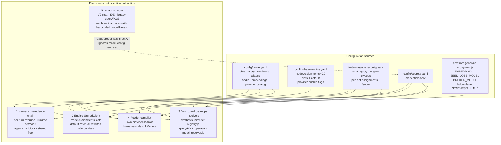
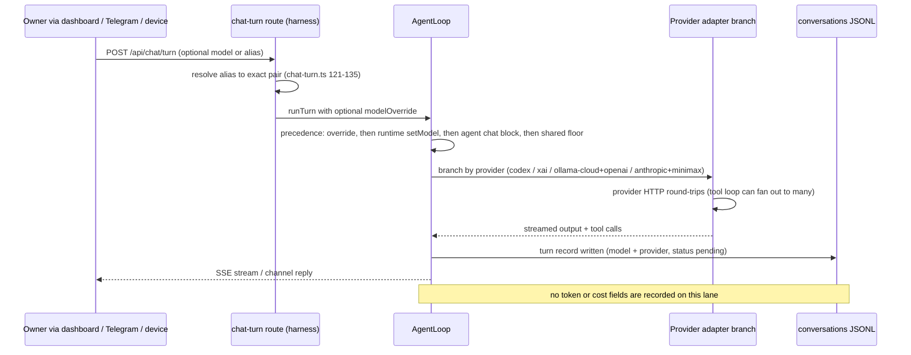
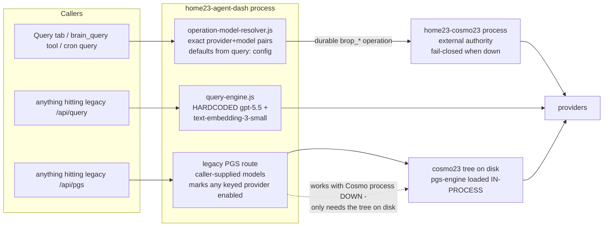
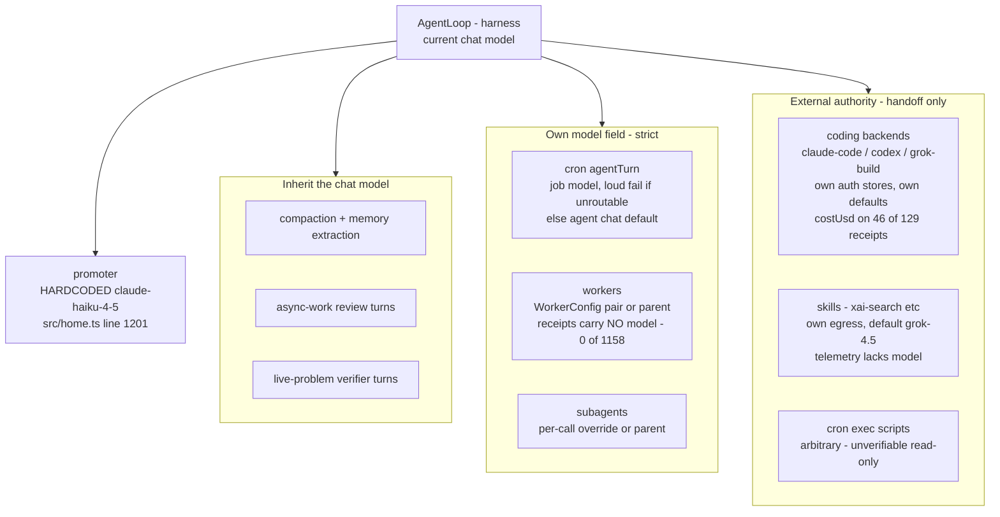
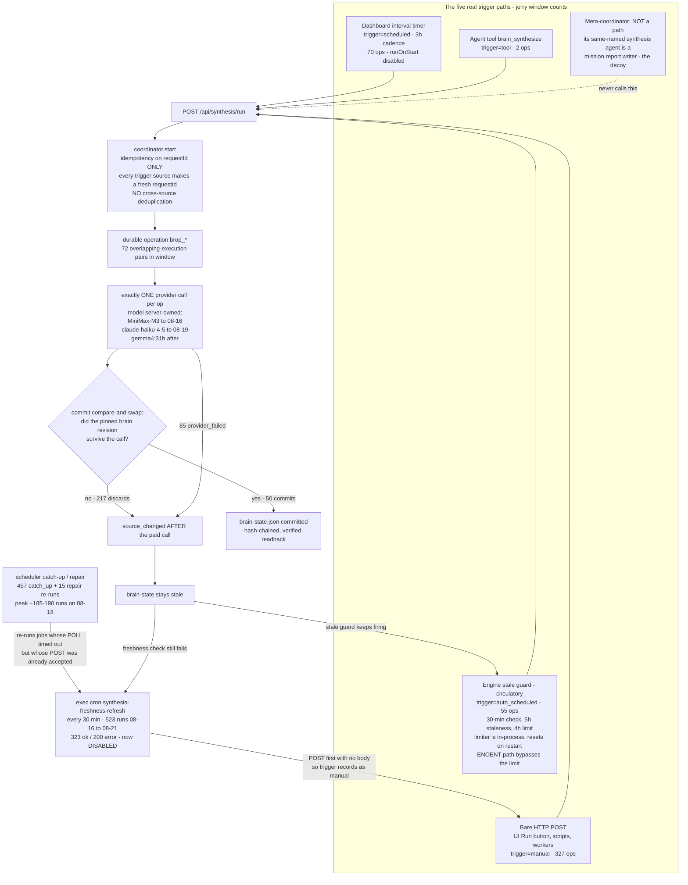
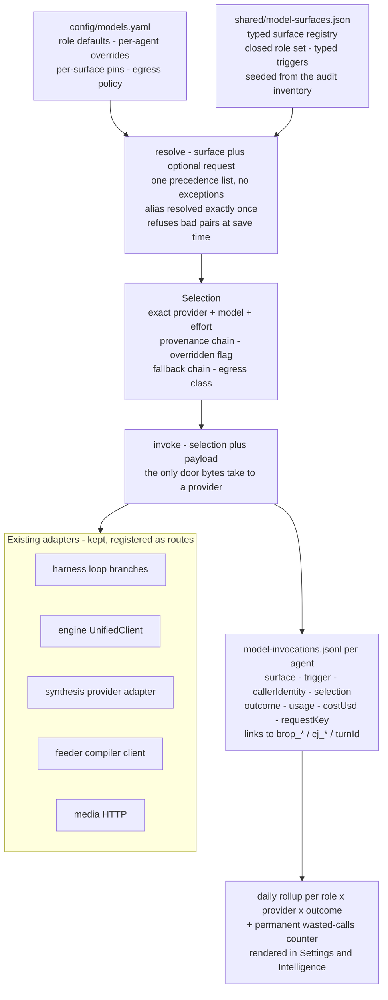

# Home23 Model Authority — Morning Brief (2026-08-22)

**For:** jtr + Jerry, 60–90 minute working session.
**Companion:** `HOME23-MODEL-AUTHORITY-DECISION-WORKSHEET-2026-08-22.md` (same directory) — use it live; this document is the reference.
**Primary sources:** `docs/audits/HOME23-MODEL-PROVIDER-RUNTIME-AUDIT-2026-08-21.md` (the audit, F1–F20), `docs/audits/HOME23-MODEL-SURFACE-INVENTORY-2026-08-21.json` (30 surfaces, machine-readable), `docs/design/HOME23-MODEL-AUTHORITY-TARGET-ARCHITECTURE-2026-08-21.md` (the proposal). Prior art: `docs/design/MODEL-PROVIDER-AUDIT-2026-08-11.md`, `docs/design/STEP3-UNIFIED-PROVIDERS-DESIGN.md`, `docs/audits/model-provider-audit-2026-07-03/README.md`.

**Verification statement.** This brief did not take the audit on faith. Every major claim below was re-opened against the live worktree and runtime stores on 2026-08-21/22 (late evening, read-only). Claims are marked:

- **VERIFIED** — re-read at the cited file:line, or re-counted from the runtime store, this pass.
- **STRONG INFERENCE** — code and adjacent receipts support it; the direct event was not observed.
- **OPEN** — genuinely unresolved; listed in §16.

Two small deltas from the audit snapshot (~22:45 EDT) to this re-count (~23:30–23:45 EDT), both benign and both explained: forrest's window synthesis attempts are now 172 (one new `scheduled` op from the 3-hour timer fired after the audit ran) and worker receipts on disk are now 1,158 (was 1,155; still **zero** carry a model field). One material development since the 08-11 audit: the engine `UnifiedClient` now has an `openai-codex` branch and jerry/forrest's live engine slots run `openai-codex/gpt-5.6-luna` — the 08-11 audit's declared deviation ("codex was NOT added to the engine") no longer holds. Whether that was a deliberate call is a question for tomorrow (§16).

No secret values were read or reproduced anywhere in this work.

---

## 1. Executive orientation (the one page)

**What exists.** Home23 makes LLM calls from ~30 distinct surfaces (chat, engine cognition, brain-state synthesis, brain query, document ingestion, workers, cron, coding agents, skills, seeds, embeddings, media, probes). There is no single place where "which model runs this" is decided. Instead, **five selection authorities run concurrently** (VERIFIED, §3): the harness precedence chain, the engine's `modelAssignments` slots, the dashboard's brain-operation resolvers, the feeder compiler's private resolver, and a legacy stratum that ignores all of the above and uses hardcoded models. Configuration for these lives across `home.yaml`, `base-engine.yaml`, per-agent `config.yaml`, generated env vars, and two hidden env overrides.

**Why it matters.** Three concrete consequences, all evidenced:

1. **Money burned invisibly.** In the 14-day window (Aug 8–21), jerry's brain-state synthesis made **432 real provider calls and committed 50 products** — 382 calls paid for and thrown away, at roughly a 1:9 commit:attempt ratio (VERIFIED by re-count, §6). The proximate cause is fixed (a cron was disabled); the structural cause — no admission-time deduplication — is not.
2. **The system lies about what ran.** ~30 engine callsites pass model literals like `'gpt-5.5'` that are silently overwritten by the `modelAssignments.default` catch-all; log banners naming models do not describe what executed (VERIFIED, `engine/src/core/unified-client.js:567-570,1162-1173`). Worker receipts (0 of 1,158), skills telemetry, seed ledgers, and async-work records carry **no model identity at all**.
3. **Nobody can state the bill.** Token/cost metering exists only on four partial lanes (engine doc-gen log lines, pulse remarks, some lobe receipts, 46/129 coding-job receipts). Chat, cron, workers, verifiers, synthesis, and skills — the highest-volume surfaces — record no usage whatsoever (§9).

**What is actually broken right now:** the synthesis admission gap (any dumb caller can recreate the storm); jerry's vision-OCR lane (a Codex-OAuth model id handed to an OpenAI-keyed client — VERIFIED in config+code, live failure unobserved); the forrest chat config carrying an invalid provider/model pair that only works by accident; metering absence; and the doctrine/topology contradiction on Cosmo (docs say Home23 doesn't host it; the generator creates and PM2 runs `home23-cosmo23` — VERIFIED live).

**What is NOT broken — resist the urge to rewrite it:** the harness chat precedence chain works and is receipted; the durable synthesis machinery itself is *excellent* (single provider call per op, compare-and-swap commit, hash-chained state, full event trail — the storm was visible *because* this store is good); the durable query path fails closed correctly; forrest's disciplined freshness caller proves the same machinery works fine at a 64% commit rate; credentials resolution was unified in the 08-11 pass and held. The engine's cognitive machinery (graph, decay, dreaming) is not implicated at all.

**The one-sentence thesis for the meeting:** the problem is not five authorities existing — several are legitimately distinct — it is that **no call is required to produce one receipt in one place, and nothing validates a selection before it runs**; fix admission, receipts, and validation first, and most of the drama disappears without a rewrite.

---

## 2. Glossary (plain English, house-specific)

| Term | Meaning in Home23 |
|---|---|
| **model** | The exact generation engine id a provider serves, e.g. `gpt-5.6-luna`, `MiniMax-M3`, `gemma4:31b`. Aliases (`sonnet5`, `grok`) map to exact ids via `home.yaml models.aliases`. |
| **provider** | A serving endpoint + credential: `openai-codex` (ChatGPT OAuth), `openai` (API key), `anthropic`, `minimax`, `xai`, `ollama-cloud` (rented), `ollama-local` (on this machine). The same model name can exist at two providers, so a bare model string is ambiguous. |
| **adapter** | The code that actually speaks a provider's HTTP/SDK dialect: harness loop branches, engine `UnifiedClient`, the synthesis provider adapter, the compiler's SDK client, media HTTP. Adapters are fine; selection is the problem. |
| **surface** | One distinct place in the system that can cause an LLM call — e.g. "chat turn", "brain-state synthesis", "feeder compiler". The audit inventoried 30 (§4). |
| **role** | A *purpose* a model serves (chat, synthesis, ingestion, lobe…). Today roles are implicit; the target architecture makes them a closed, typed set. |
| **authority** | A body of code that decides which provider+model a call uses. Home23 has five concurrent ones (§3). |
| **override** | A per-call or per-env choice that beats configured defaults — e.g. a per-turn model in chat, cron job `model:` field, `SYNTHESIS_LLM_*` env vars. |
| **fallback** | The pair tried when the primary fails. Engine slots carry per-slot fallback chains (`ollama-cloud/kimi-k3:cloud` after the 08-11 repair). |
| **receipt** | A durable record that a call happened, with what model/outcome. Quality varies wildly: synthesis ops have superb receipts; worker runs have receipts with no model; skills have telemetry with no model; some lanes have nothing. |
| **egress** | Content leaving this machine to a rented endpoint. `ollama-cloud` is egress (rented), despite the name. Only `ollama-local` and deterministic substrate code are egress-free. |
| **synthesis** | Specifically *brain-state synthesis*: a durable dashboard operation that reads identity files + pinned brain nodes and commits `brain-state.json`. Not to be confused with the engine's *mission* "synthesis agent" (a report writer) — the naming decoy that broke the Aug-19 audit (F12). |
| **PGS** | Partitioned Graph Synthesis — brain-wide query answering: many cheap "sweep" calls across partitions, then one strong "synth" call. Exists in a durable Cosmo-backed form and a legacy in-dashboard form. |
| **coding backend** | An external CLI (claude-code, codex, grok-build) spawned for coding jobs. Own auth, own model defaults; Home23 records the handoff, not the internals. |
| **worker** | A harness-side scheduled/named background agent run (e.g. shakedown proposer) with its own conversation; model comes from WorkerConfig or the parent agent. |
| **cron agentTurn / query** | Two cron job types: `agentTurn` runs a full agent conversation turn (job may pin a model — strict, loud-fail); `query` runs a durable brain query with an exact pair. A third type, `exec`, shells out to arbitrary scripts and is unverifiable read-only. |

---

## 3. How a model gets chosen today (end-to-end)

### 3.1 Configuration precedence (VERIFIED)

Merge order, lowest to highest:

1. **`config/home.yaml`** — house defaults: `chat:` (openai-codex/gpt-5.6-terra, line 254-256), `query:` (terra + PGS pair gpt-5.4-mini, 472-480), **`synthesis:` (ollama-cloud/gemma4:31b, intervalHours 3, lines 482-485)**, ~35 aliases, media, embeddings, provider catalogs. Notably **no `cosmo23:` block exists** — the Cosmo port falls back to 43210 in code.
2. **`configs/base-engine.yaml`** — engine structure: `modelAssignments` with ~20 slots **plus a `default:` catch-all = minimax/MiniMax-M3** (lines 381-384); provider enable flags (`openai: false`; minimax/xai/local/ollama-cloud true, 355-377).
3. **`instances/<agent>/config.yaml`** — per-agent wins per-slot. The `engine.thought` shortcut sweeps every cognitive slot except pulse/chat (`config-loader.js:170-177`), then per-slot `modelAssignments` win (`:218-241`). Live: jerry chat `openai-codex/gpt-5.6-sol` + `reasoningEffort: high`; forrest chat block is the **mismatched pair `provider: minimax` + `model: gpt-5.6-terra`** (config lines 114-118 — accepted by everything, works only because call-time inference routes by model name); jerry feeder `visionModel: gpt-5.6-luna` (line 87 — a Codex-OAuth id destined for an OpenAI-keyed python client, F10).
4. **`config/secrets.yaml`** — credentials only, through `resolveProviderKey` (values never read by this work).
5. **Environment** — injected by `cli/lib/generate-ecosystem.js` (`EMBEDDING_*`, `SEED_LOBE_MODEL`, `BROKER_MODEL`…) plus **hidden override lanes set nowhere in the generated env**: `SYNTHESIS_LLM_PROVIDER/MODEL` (`provider-registry.js:93-106`), `OPENAI_DEFAULT_MODEL`, `MLM_MODEL`, `SEED_EMBED_*`.

Floor: `shared/model-defaults.cjs:19-31` — the single fleet floor table since the 08-11 consolidation (`ollama-cloud/kimi-k3:cloud` chat floor + per-provider last resorts).

### 3.2 The five authorities (Diagram 1)

**Authority 1 — harness chain** (VERIFIED: `src/routes/chat-turn.ts:121-135`, `src/agent/loop.ts:407-408`, `src/home.ts:394-398`, `src/commands/handler.ts:227-243`): per-turn override (alias-resolved) → runtime `setModel` (persisted to agent config by `/model`) → agent `chat:` block → shared floor. Clean, receipted in conversation JSONL, and the best-behaved of the five.

**Authority 2 — engine `UnifiedClient` + `modelAssignments`** (VERIFIED: `engine/src/core/unified-client.js:560-578,932-936,1146-1197`): resolves `component.purpose` → slot; **any callsite that passes no component, or an unknown one, silently falls to `modelAssignments.default`**, and the caller's explicit `model:` string is overwritten. ~30 callsites pass cosmetic literals. Live effective slots (boot echoes): jerry/forrest all `openai-codex/gpt-5.6-luna`. The catch-all is why "what does the engine run?" cannot be answered from code or logs — only from boot echoes and per-response fields.

**Authority 3 — dashboard brain-operation resolvers** (VERIFIED: `engine/src/synthesis/provider-registry.js:17-21,67,93-106`; caller-override refusal `engine/src/dashboard/brain-operations/coordinator.js:569-573`): synthesis model is **server-owned** — env override → `home.yaml synthesis:` → default minimax/MiniMax-M3; callers are *refused* if they try to pick. Query/PGS use exact pairs with defaults from the query config. This is *good* centralization — keep the law, fix the admission (§6).

**Authority 4 — feeder compiler** (VERIFIED: `engine/src/ingestion/document-compiler.js:156-168`): resolves its own provider by scanning `home.yaml` `providers.*.defaultModels`, builds its own SDK client, rotation-aware. Works, but it's a fourth resolver with its own rules.

**Authority 5 — legacy stratum** (VERIFIED: `engine/src/dashboard/query-engine.js:410,810`; `engine/src/ide/ai-handler.js:534`; `engine/src/dashboard/server.js:3690-3698,8944-9024`; probes `home23-settings-api.js:1038-1050`, `services/encryption.js:152-153`): hardcoded `gpt-5.5`, `gpt-4o`, `text-embedding-3-small`, `claude-3-5-haiku-20241022`; the legacy `/api/pgs` loads the Cosmo tree **in-process**, marks any secret-bearing provider enabled, and works with the Cosmo process down. No durable receipts. No window evidence of use — but reachable today.

### 3.3 Normal chat request flow (Diagram 2)

Compaction, memory extraction, async-work reviews, and live-problem verifier turns all inherit whatever model the conversation is currently on. Cron `agentTurn` jobs may pin a model — unroutable pins fail the job loudly (VERIFIED `src/home.ts:837-848`). The promoter ignores all of this: hardcoded `claude-haiku-4-5` (VERIFIED `src/home.ts:1201`).

---

## 4. The 30 surfaces — a taxonomy you can hold in your head

Flat tables don't survive a meeting. The 30 audited surfaces (numbering follows the audit's §3 table; full evidence per surface in the inventory JSON) fall into **five families by who picks the model**:

### Family 1 — The Voice chain (8 surfaces): "whatever the agent is speaking with"

Model = the harness precedence chain. Receipts: conversation JSONL (model recorded, tokens not).

| # | Surface | Note |
|---|---|---|
| 1 | Chat turn (dashboard/Telegram/devices/evobrew bridge) | jerry 457 user-chat turn-starts in window; 1,364 total with model field |
| 2 | Compaction + memory extraction | inherits live conversation model |
| 3 | Subagent tool | strict per-call override or parent (jerry 34) |
| 4 | Cron `agentTurn` | job `model:` strict/loud-fail, else chat (jerry 423, forrest 183) |
| 6 | Async-work review turn | agent chat model (jerry 13) |
| 7 | Workers | WorkerConfig pair or parent (jerry 356 turn-starts; **receipts carry no model**) |
| 10 | Live-problem verifier turns | agent chat model (jerry 81, forrest 201) |
| 30 | `/model` `/models` `/effort` commands | the knob itself; persists to agent config.yaml |

*Interpretation:* this family is healthy. Its one systemic flaw is observational — turn counts are floors (tool loops fan out) and nothing meters tokens.

### Family 2 — Purpose-bound lanes (6 surfaces): "a config key names a model for a job"

| # | Surface | Selection | Note |
|---|---|---|---|
| 11 | Engine cognition | `modelAssignments` slots + **default catch-all** | the F2 problem lives here |
| 12 | Pulse remarks | `pulseVoice` slot (protected from sweeps) | well-receipted incl. usage |
| 13 | Feeder compiler | own resolver (authority 4) | manifest records provenance |
| 14 | Feeder vision OCR | `visionModel` → `MLM_MODEL` env → OpenAI-keyed python | **F10: jerry's config is a codex id — lane likely broken** |
| 22 | Agent media tools (image/music/TTS) | per-call → `media.*` → literals | 2 images in window; TTS disabled |
| 25 | Embeddings | `EMBEDDING_*` env honored at 2 sites, **bypassed by 4 hardcoded `text-embedding-3-small` sites** | F15: mixed vector spaces |

*Interpretation:* legitimate purpose separation (a compiler model *should* differ from a chat model). The defects are validation (F10, nothing checks a model against its executing adapter) and stragglers (F15).

### Family 3 — The Organs (6 surfaces): "dashboard-owned durable brain operations; the server owns the model"

| # | Surface | Note |
|---|---|---|
| 15 | **Brain-state synthesis** | server-owned selection; callers refused; §6 is entirely about this surface |
| 16 | Brain query + hosted PGS (durable) | exact pairs; fail-closed on Cosmo down (jerry 64 query ops all-time) |
| 20 | Intelligence tab schedule + Run button | same durable path, trigger `scheduled`/`manual` |
| 28 | Cosmo research ops | delegated to Cosmo's own authority; provider receipts live Cosmo-side |
| 29 | `brain_synthesize`/`brain_query` agent tools | forwarders into 15/16; cannot pick synthesis models |
| 5 | Cron `query` | forwarder into 16 with exact pair |

*Interpretation:* the best-engineered receipts in the house and the correct authority model (server-owned). The storm happened here anyway — because admission, not selection, was the gap.

### Family 4 — The Handoffs (4 surfaces + 1 boundary): "external authority; the house records the handoff at best"

| # | Surface | External authority | Blind spot |
|---|---|---|---|
| 9 | Coding backends (claude-code/codex/grok-build) | CLI's own auth + defaults | `costUsd` on 46/129 jerry receipts only |
| 23 | Skills (xai-search, xai-x-search, music) | skill JS with own egress + literals (default grok-4.5) | telemetry lacks model (97 xai-search runs in window) |
| 24 | Seed lobes (jerry/forrest local; bobby broker) | `SEED_LOBE_MODEL`/`BROKER_MODEL` env → claude-haiku-4-5 | seed ledgers record **no model** (STRONG INFERENCE that haiku served them) |
| 27 | Evobrew internals | own config + hardcoded literals | evobrew-local logs only |
| — | Cron `exec` jobs (JSON inventory surface; boundary F20) | arbitrary scripts | LLM usage unverifiable read-only (~45 enabled fleet-wide) |

*Interpretation:* forcing these through a central resolver would be wrong (coding CLIs and Cosmo own their internals; substrate law protects seeds). The fix is receipts at the boundary, not control.

### Family 5 — The Fossils (6 surfaces): "hardcoded models and authority bypasses"

| # | Surface | Hardcoded / bypass | Window use |
|---|---|---|---|
| 8 | Promoter | `claude-haiku-4-5` literal, `home.ts:1201` | runs continuously, unmetered |
| 17 | Legacy `/api/query` | `gpt-5.5` + `text-embedding-3-small` | none observed; reachable |
| 18 | Legacy `/api/pgs` | caller-supplied models; in-process Cosmo tree; enables any keyed provider | none observed; **works with Cosmo down** |
| 19 | Legacy V2 chat + IDE | `gpt-5.5`, `gpt-4o`, stale claude ids | none observed; reachable |
| 21 | Vibe commentary/theme/image | config cascade ending in dead literal `kimi-k2.6` | dormant since 07-28 |
| 26 | Provider probes (Settings test, key-test) | 1-token `MiniMax-M3` generation; 2024-era `claude-3-5-haiku-20241022` | operator-triggered |

*Interpretation:* low current volume, real exposure. These are the deprecate/gate candidates — none deserves rework, only retirement or labeling.

---

## 5. The query/PGS boundary and the delegation fabric

### 5.1 Brain query / direct query / PGS boundary (Diagram 3)

The durable lane is correct: exact pairs, typed `worker_transport_failed` when Cosmo is down (VERIFIED `cosmo-worker-client.js:143,236-237`). The two legacy doors bypass everything. **And note the contradiction they sit inside (F3):** `CLAUDE.local.md` doctrine says Home23 does not host Cosmo, but `cli/lib/generate-ecosystem.js:638-665` generates the `home23-cosmo23` PM2 app, seeds its `DATABASE_URL`/`ENCRYPTION_KEY`, lists it in `configuredProcessNames` (`:709`), and the process is **online right now** (VERIFIED live via PM2 this pass). Either outcome is fine; holding both is not.

### 5.2 Worker / cron / subagent / coding-agent delegation (Diagram 4)

---

## 6. The synthesis story: 432 calls, 50 commits — carefully

This is the finding most likely to be misquoted, so here is the precise version.

### 6.1 What was counted (VERIFIED by independent re-count this pass)

Unit = a **durable synthesis operation** (`brop_*` directory under `instances/<agent>/runtime/brain-operations/operations/`). For jerry and forrest, each operation with a `provider_call_terminal` event made **exactly one real provider call** (singleton contract, VERIFIED `coordinator.js` + `synthesis-agent.js:628-652`). These are not "attempts" in the soft sense and not per-op retry inflation.

**Window = 2026-08-08 through 2026-08-21, America/New_York.** Re-counted from the store this pass:

| agent | attempts | provider-called | committed | source_changed | provider_failed | other failures |
|---|---|---|---|---|---|---|
| jerry | 452 | **432** | **50** | 217 | 85 | operation_not_found 69, worker_interrupted 14, source_busy 11, response_invalid 4, synthesis_failed 2, aborted pre-call 19 |
| forrest | 172* | 171 | 109 | 39 | 19 | small tail |
| grokbot | 6 | 0 | 0 | — | — | all `source_unavailable` (engine/brain absent) |

*forrest was 171 at audit time; one new `scheduled` op landed between the audit and this re-count.

Jerry trigger labels, re-counted: **`manual` 327, `scheduled` 70, `auto_scheduled` 55** — matching the audit exactly.

### 6.2 Do not read this as "432 Gemma calls"

The synthesis model **walked during the window** (VERIFIED against `home.yaml` history reconstructed by the audit + op parameters): `MiniMax-M3` through ~08-16 → `claude-haiku-4-5` 08-16→08-19 → `gemma4:31b` (ollama-cloud) from 08-19. The spike days (08-15→08-19: 37/55/66/88/97 ops/day) ran mostly on **claude-haiku-4-5**, with MiniMax early and Gemma late. The *current* selection is `ollama-cloud/gemma4:31b @ 3h` (VERIFIED, home.yaml lines 482-485). Per-op token counts were never recorded, so the storm's dollar cost is **unknowable from local receipts** (§9).

### 6.3 The causal chain (Diagram 5; each link's status marked)

Link-by-link status:

1. **The flood was trigger `manual` (327 of 452).** VERIFIED by re-count. `manual` is the default when `POST /api/synthesis/run` arrives with no body (`synthesis-compatibility-routes.js:219`).
2. **The driver was the `synthesis-freshness-refresh` exec cron** (`agent-e532ec1c…`, `*/30 * * * *`, now `enabled: false`). Its run history: **523 runs, 323 ok / 200 error, 2026-08-16T06:15Z → 2026-08-21T01:52Z**, peak day 08-18 (~185–190 runs depending on timezone binning). VERIFIED by re-count this pass. (Forrest had a parallel exec cron, `forrest-synthesis-freshness-refresh`, also now disabled — her `manual` count is only 2, so it barely fired; VERIFIED in her cron store.)
3. **Errored runs were poll-timeouts whose POST had already been accepted** — the plain `scripts/refresh-synthesis.cjs` POSTs *first with no body* (`:83-86`) then polls (`:92-103`). VERIFIED in source. The scheduler's catch-up/repair machinery then re-ran errored jobs (457 catch_up + 15 repair decisions in surviving archives, 08-18→08-21 — audit count, decisions before 08-18 rotated away).
4. **Which script binary ran before 08-20 is STRONG INFERENCE, not fact.** The job's *current* payload names `instances/jerry/bin/refresh-synthesis-verified.cjs` (typed trigger, freshness pre-check) — but that file's mtime is **Aug 20 21:50** (VERIFIED), zero window ops carry its trigger string, and 327 ops say `manual`. The payload was edited at the end of the spike; the pre-edit binary is inferred from trigger strings + mtimes.
5. **No admission-time dedup exists.** Coordinator idempotency keys on caller `requestId` only (VERIFIED `coordinator.js:1319-1331`), and every trigger source mints a fresh requestId (VERIFIED routes `:136-142,222` and executor `server.js:1190`). Concurrent triggers from different sources each became a new operation with its own provider call → **72 overlapping-execution pairs** (audit count from op timestamps).
6. **Losers paid before losing.** The commit is a compare-and-swap against the pinned brain revision (VERIFIED `synthesis-agent.js:738-804`); jerry's brain revision moves constantly, so a multi-minute call frequently returned to find `source_changed` (`:802-804`) — **after** the provider completed. 217 in-window discards. Each failure left `brain-state.json` stale, which kept both the freshness cron and the engine stale guard firing: **self-amplifying**.
7. **The coordinator never retried anything.** External callers did (the cron loop; the scheduler). VERIFIED: no auto-retry of failed ops; boot reconcile re-drives *interrupted* ops only.
8. **The loop broke ~08-20/21**: cron disabled, verified-script replacement created, attempts collapsed to 6 on 08-21. VERIFIED (cron store `enabled:false`, per-day counts).

**What remains uncertain:** the pre-08-20 script binary (link 4); the exact mechanism of the 69 `operation_not_found` failures (store race under storm — needs targeted reproduction, U4); the dollar cost (never metered).

**The counterpoint that proves the machinery is fine:** forrest's disciplined freshness caller (3-hourly agentTurn: POST with typed trigger `scheduled_freshness`, poll, retry exactly once on `source_changed`) produced 59 ops at a ~64% commit rate on the *same* coordinator. The storm was a caller-discipline + admission problem, not a synthesis-engine problem.

---

## 7. Settings/UI problems vs backend authority problems — keep them separate

These get conflated; they need different fixes and different owners.

**UI/settings problems (the control panel lies or is missing):**

| ID | Problem | Evidence |
|---|---|---|
| S1 | Brain-state synthesis has **no Settings control at all**; config-only + hidden `SYNTHESIS_LLM_*` env override | `provider-registry.js:67,93-106` (VERIFIED) |
| S2 | "Engine Duties" page shows only engine `modelAssignments` — dashboard-process surfaces (synthesis, query resolvers) and harness surfaces are absent. This exact blind spot produced the failed Aug-19 audit | audit §7 |
| S4 | Provider "Test" buttons are undeclared real generations (1-token `MiniMax-M3`; 2024-era `claude-3-5-haiku-20241022` key-test) | `home23-settings-api.js:1038-1050`, `encryption.js:152-153` (VERIFIED) |
| S5/F9 | forrest's invalid chat pair accepted on save/load | forrest config 114-118 (VERIFIED) |
| S6/F10 | Feeder settings accept a vision model the executing client can't serve | jerry config :87 + `convert-file.py:142-143` (VERIFIED) |
| S9 | Cron `model:` fields have no UI/validation surface | cron stores |
| S12/F17 | Docs contradict code (6h vs 5h/30min/4h; 4h vs 3h schedule; nonexistent `cosmo23.baseUrl` key) | audit §7 |

**Backend authority problems (the machine itself misbehaves):**

| ID | Problem |
|---|---|
| F1 | No admission-time dedup on synthesis operations (the storm remains reproducible by any bare-POST caller) |
| F2 | `modelAssignments.default` silently rewrites ~30 callsites; literals and logs lie |
| F4/F19 | Legacy strata bypass all selection + receipts |
| F5/F6 | No unified metering; no model identity on worker/skill/seed/async receipts |
| F8 | Free-form trigger strings; `manual` conflates UI and automation |
| F15 | Embedding fragmentation (mixed vector spaces + off-config egress) |
| F18 | Promoter hardcoded, off-ledger |

A settings redesign that doesn't fix admission/receipts changes nothing; an admission fix without S1/S2 keeps operators blind. Both, in that order of urgency.

---

## 8. Privacy & egress — what leaves the machine, from where

Egress classes: **local** (this machine — ollama-local, deterministic substrate), **rented** (any cloud endpoint incl. ollama-cloud), **external-cli** (coding backends with own auth).

| Surface family | What crosses the boundary | Destination today | Notes |
|---|---|---|---|
| Synthesis (15) | **SOUL.md, MISSION.md, BRAIN_INDEX.md + pinned brain nodes** — the identity core | ollama-cloud (rented), previously anthropic + minimax | The single most sensitive prompt in the house. Owner has never made this call explicitly (audit open q3) |
| Chat family (1,2,3,4,6,10) | Full conversations + assembled identity/context surfaces | openai-codex mostly; xai on manual grok picks; anthropic on cron sonnet jobs | Highest volume |
| Engine cognition (11,12) | Thoughts, goals, dream content, brain fragments | openai-codex (luna) live; minimax configured on grokbot | ~2.09M jerry + ~4.13M forrest tokens visible on the one metered lane (08-20/21 logs only) |
| Feeder (13,14) | Full document content being ingested | openai-codex (terra) configured | Historical drift: glm-5.2:cloud actually ran on jerry per the 08-20 reconciliation |
| Query/PGS durable (16) + research (28) | Query text + brain-derived context | via Cosmo → its configured providers | Fail-closed when Cosmo down |
| Workers/cron/verifiers (7,4,10) | Task prompts incl. brain-derived material | parent chat model's provider | No model in worker receipts → egress destination unproven per-run |
| Coding backends (9) | **Repository code + prompts** | Anthropic / OpenAI / xAI via CLIs | Own auth; Home23 sees receipts only |
| Skills (23) | Search queries (may embed owner context) | xAI directly, own key access | No model in telemetry |
| Seed lobes (24) | Situation-cell content at development openings | Anthropic (haiku) — STRONG INFERENCE from env config | Ledgers don't record the server |
| Embeddings (25) | Brain/memory text (vectors) | ollama-local (primary; no egress) — **but 4 hardcoded sites ship text to OpenAI where keyed** | F15 |
| Promoter (8) | Notification/candidate digests | Anthropic | Hardcoded |
| Legacy strata (17,18,19) | Caller-directed brain content | caller-directed | Off-ledger entirely; no window use observed |
| Probes (26) | 1-token pings | minimax/anthropic | Trivial but undeclared |

**The decision hiding here:** synthesis is currently on a *rented* endpoint (`ollama-cloud/gemma4:31b`). A gemma-class model is plausibly servable **locally** (the 08-11 audit's `reflex` tier argument; `LOCAL_LLM_BASE_URL` is already plumbed to every process). Whether identity-bearing prompts may leave the house at all should be a one-time explicit config decision, not an incident-by-incident accident. That is jtr's call to make tomorrow (§16, D2).

---

## 9. Metering blind spots — what cost claims can and cannot be made

**Can be stated from local evidence (floors, VERIFIED):**

- Engine doc-gen tokens on the luna lane, surviving logs only (08-20/21): jerry ~2.09M, forrest ~4.13M total tokens. MiniMax log lines carry **no usage block**.
- Pulse remarks: per-call usage recorded (jerry 140, forrest 113 in window, all luna).
- Coding jobs: `costUsd` on 46/129 jerry receipts — **$153.77 all-time, $45.46 in-window** — floors, not totals.
- Lobe receipts: real token counts where the provider branch populates `usageSink` (ollama/openai/xai verified; **anthropic-SDK branch unverified — U3 — which is exactly the branch lobes run on**).

**Cannot be stated, at any confidence:**

- Total fleet spend, per-agent spend, or monthly run-rate — no basis.
- **The dollar cost of the 432-call storm** — synthesis ops record no tokens; the models involved (MiniMax → haiku → gemma) span three price regimes; any number would be invented.
- Chat/cron/worker/verifier token totals — turn records carry model but no usage, and each turn fans out to an unknown number of provider round-trips.
- Skills spend (xAI Responses calls, 97 in window, no usage recorded); promoter spend; media spend beyond the 2 image receipts.
- Whether "local-first would save $X" — the comparison lacks both sides.

Anything in tomorrow's discussion phrased as "this costs us…" should be challenged unless it cites the coding-receipt or doc-gen numbers above.

---

## 10. Findings ranked for decision-making

Axes: urgency (how soon it bites again), blast radius, confidence, operator pain (day-to-day), cost exposure, privacy exposure, migration difficulty (to fix properly). Severity/confidence carry over from the audit; the two rightmost columns are this brief's judgment.

**Tier 1 — act this week:**

| ID | Finding | Urgency | Blast | Conf | Operator pain | Cost | Privacy | Difficulty |
|---|---|---|---|---|---|---|---|---|
| F1 | Synthesis admission gap (storm reproducible; cron fix was symptomatic) | high | dashboard + spend + freshness | high | high (it already ate a week of attention) | high | med (identity prompt per wasted call) | **low-med** — coalescing is a contained coordinator change |
| F10 | jerry vision OCR: codex id at OpenAI-keyed client | high (silently broken capability, repeat of glm bug class) | jerry ingestion | med (live failure unobserved) | med | — | — | **trivial** — config edit + save-time validation later |
| F5 | No unified metering | high (blocks every economic decision incl. tomorrow's) | fleet economics | high | high | unknown ≠ small | — | med — additive receipts first |
| F3 | Cosmo doctrine vs live topology | high (a decision, not code) | query/PGS/research + secrets seeding | high | med | low | med (env injection into Cosmo) | **decision-only** |

**Tier 2 — next month:**

| ID | Finding | Urgency | Blast | Conf | Operator pain | Cost | Privacy | Difficulty |
|---|---|---|---|---|---|---|---|---|
| F2 | Engine default catch-all rewrites ~30 callsites | med (currently uniform luna, so masked) | all engine cognition | high | med (logs lie) | med | med (egress invisible) | med-high — the highest-risk flip; needs shadow goldens |
| F4/F19 | Legacy strata bypass | med (no window use, but reachable + off-ledger) | dashboard HTTP | high | low | med | med-high (caller-directed egress) | low — 403-gate; removal needs owner sign-off |
| F6 | No model identity on worker/skill/seed/async receipts | med | attribution | high | med | — | med (egress unprovable) | **low — additive fields** |
| F8 | Free-form triggers; `manual` ambiguity | med | synthesis attribution | high | med (it hid F1) | — | — | low |
| F9 | Invalid pair accepted (forrest) | med | chat lane | high | low | — | — | low — save/load validation |
| F15 | Embedding fragmentation | med | memory quality + egress | high | low | low | med | med (reindex ceremony) |

**Tier 3 — debt, schedule but don't agonize:**

| ID | Finding and disposition |
|---|---|
| F7 | Probe buttons: label + typed probe role; keep the function |
| F11 | Stale-guard limiter quirks: persist `lastTriggerAt`, document ENOENT bypass |
| F12 | Rename `engine/src/agents/synthesis-agent.js` → mission-synthesis-agent (rename-only) |
| F13 | Skills egress: receipt-level declarations v1 |
| F14 | grokbot zombie — operator decision on residency (PM2 online, engine log dead since 08-17, paths on /Volumes/Casey Jones) |
| F16 | Evobrew hardcoded models — expose/accept at boundary |
| F17 | Doc drift fixes |
| F18 | Promoter → config key + receipt |
| F20 | Cron exec egress declarations |

---

## 11. Verdict per authority class — keep, repair, consolidate, or retire

| Authority | Verdict | Why |
|---|---|---|
| 1. Harness precedence chain | **KEEP** (+ small repair: save-time pair validation, F9) | Best-behaved: explicit precedence, alias resolution at the door, receipts in conversation JSONL, persistence works. Do not disturb. |
| 2. Engine `modelAssignments` + UnifiedClient | **REPAIR then CONSOLIDATE** | Slots are a legitimate concept (cognition needs per-purpose routing). The `default` catch-all + cosmetic literals must go — but via shadow-verified replacement (Stage 2-3), never a direct rip-out. Adapters stay. |
| 3. Dashboard brain-op resolvers | **KEEP the law, REPAIR admission, EXPOSE in UI** | Server-owned synthesis selection with caller refusal is *correct* centralization — the target architecture keeps it verbatim. Fix: requestKey coalescing at admission (F1), typed triggers (F8), a Settings surface (S1). |
| 4. Feeder compiler resolver | **KEEP short-term, CONSOLIDATE later** | Rotation-aware, provenance-stamping, works. It's redundant, not dangerous. Absorb into the shared resolver when the contract exists. |
| 5. Legacy stratum | **RETIRE** | 403-gate now behind a flag; removal only after 30 days of zero-hit evidence **and explicit owner permission** (house rule: nothing is deleted without it). |

**Where centralization would be harmful — leave these alone:**

- **Coding CLIs and Cosmo internals** — external authorities by design. Record the handoff (`external-cli` egress class + receipt), never proxy their selection.
- **Seed lobes** — substrate law (typed deltas, membrane, degraded-honest) governs them; they should *emit receipts to* a unified ledger, not take orders from a resolver. Env-based selection stays until they become clients of the contract on their own terms.
- **Skills and cron exec** — can't be technically forced through a resolver without breaking their nature; fence with receipt-level egress declarations (v1), revisit later.
- **The synthesis caller-refusal rule** — resist any "let the caller pick the synthesis model" convenience; that door being closed is why the storm was merely expensive and not also incoherent.

---

## 12. Three architecture options

### Option A — Minimal repair (fix the bleeding, keep five authorities)

Scope: admission requestKey coalescing + typed trigger enum (F1/F8); jerry visionModel config fix + save-time pair/capability validation (F9/F10); synthesis block rendered in Settings incl. env-override banner (S1); additive `model` fields on worker/skill/async receipts (F6); F12 rename; probe labeling (F7).

- **Effort:** days.
- **Tradeoffs:** stops the storm class on synthesis only; economics stay blind (no ledger); the catch-all keeps lying; the legacy stratum stays reachable; the next storm-shaped failure lands on an uninstrumented surface.
- **Risks:** low. **Reversibility:** trivial (all additive or contained).

### Option B — Contract-first consolidation (the target-architecture proposal) — **recommended**

Scope: everything in A **as its Stage 0/1**, then: typed surface/role registry seeded from the inventory JSON; unified invocation receipts (`model-invocations.jsonl` + daily rollups + wasted-calls counter); `resolve()` in shadow mode with golden tests per surface and a daily divergence report; per-class enforcement flips (cognition catch-all deleted only after shadow proves equivalence); admission coalescing; legacy 403-gating; egress policy last.

- **Effort:** weeks, in independently shippable stages; no stage rewrites an adapter.
- **Tradeoffs:** discipline-heavy (shadow-mode divergence triage is real work); the payoff — one receipt stream, loud resolution, validated selection — arrives incrementally rather than at once.
- **Risks:** medium, isolated per stage; the riskiest flip (engine catch-all removal) is gated behind 7 days of zero unexplained shadow divergence and a per-class canary.
- **Reversibility:** every stage has a flag-off or file-delete rollback; the ledger records which flags were active per invocation; consistent with substrate law (no history rewritten).

### Option C — Aggressive unification (one resolver, one config, now)

Scope: write `models.yaml`, point every callsite at one resolver in a single push, delete `modelAssignments`, the catch-all, the legacy routes, and the lenient inference lane immediately; force skills/lobes through the resolver.

- **Effort:** looks like a fortnight; historically this shape becomes a quarter.
- **Tradeoffs:** conceptual cleanliness at the cost of a flag day across the highest-volume lane in the house (engine cognition) with no shadow evidence; breaks the substrate boundary (lobes taking selection orders from harness-side config contradicts membrane law); guarantees a period where receipts are *worse* mid-migration.
- **Risks:** high — this is exactly the move the brief's own evidence argues against: the organs with the best receipts today got them by evolution, not decree.
- **Reversibility:** poor once `modelAssignments` is deleted.

**Recommendation: Option B.** It subsumes A (do A's items first, this week, as Stage 0/1), reaches C's end-state where that end-state is actually right, and refuses C's flag day. Do **not** unify what is legitimately distinct: server-owned synthesis selection, external CLI authority, substrate law, and per-purpose engine slots all survive in B on purpose.

### Target shape (Diagram 6)

---

## 13. Phased sequence — smallest safe slice, gates, rollback, no flag day

(Adapted from the target-architecture doc §9, with this brief's Tier-1 items pulled forward. Diagram 7.)

```mermaid
flowchart LR
    S0["Stage 0 - Freeze + baseline<br/>registry file, receipt schema,<br/>F12 rename, F10 config fix,<br/>S1 settings render read-only"]
    S1S["Stage 1 - Observe<br/>receipt shims on existing paths,<br/>additive model fields on<br/>worker/skill/async receipts"]
    S2["Stage 2 - Resolve in shadow<br/>models.yaml generated from<br/>current effective config,<br/>daily divergence report"]
    S3["Stage 3 - Enforce per class<br/>cognition first - catch-all deleted,<br/>then synthesis/query,<br/>then chat/workers, then media"]
    S4["Stage 4 - Coalesce + typed triggers<br/>requestKey admission dedup,<br/>freshness owned by ONE caller,<br/>engine guard demoted to alerting"]
    S5["Stage 5 - Retire legacy<br/>403-gate /api/query /api/pgs<br/>/api/chat + IDE model paths,<br/>removal ONLY with owner sign-off"]
    S6["Stage 6 - Egress policy<br/>identity-to-rented decision<br/>enforced in resolve"]
    S0 -->|"gate: build + tests green,<br/>zero runtime behavior diff"| S1S
    S1S -->|"gate: 7 days of ledger reconciling<br/>within 5 percent of brop store<br/>and conversation counts"| S2
    S2 -->|"gate: 0 unexplained divergences<br/>for 7 days across 30 golden surfaces"| S3
    S3 -->|"gate: 72h per class at or below<br/>baseline error rate - canary agent first"| S4
    S4 -->|"gate: commit-to-attempt at least<br/>1 to 1.5 over 7 days - storm replay<br/>test yields 1 op per interval"| S5
    S5 -->|"gate: 30 days zero legacy hits<br/>PLUS explicit owner permission"| S6
    S1S -.->|"rollback: remove shims"| S0
    S2 -.->|"rollback: shadow flag off"| S1S
    S3 -.->|"rollback: per-class flag revert"| S2
    S4 -.->|"rollback: coalescing flag off"| S3
    S5 -.->|"rollback: gate back to allow"| S4
```

**Smallest safe slice (can start tomorrow afternoon):** Stage 0 — land `shared/model-surfaces.json` (a **new** file proposed by the target architecture; it does not exist yet) seeded from the inventory JSON, land the receipt schema, rename the mission synthesis agent, apply the jerry `visionModel` config fix (operator applies; config is local state), render the synthesis block read-only in Settings. Zero behavior change; rollback = delete files.

**Key gate details:**

- The F1 regression test (Stage 4): 50 concurrent bare POSTs to `/api/synthesis/run` must admit exactly 1 operation. Forrest's retry-once flow must still work (distinct legitimate triggers hash to distinct requestKeys).
- Canary agent for Stage 3 flips: forrest (or grokbot once residency is resolved — not before).
- Stage 3's cognition flip is the highest-risk moment in the whole plan; it happens only against 7 days of shadow-mode goldens, per-class flags, and 72h canary observation.
- **Nothing is ever deleted without explicit owner permission** (Stage 5 hard rule, consistent with house law).

---

## 14. Source map — where every major claim lives

Status: ✅ = VERIFIED this pass (2026-08-21/22, read-only). SI = strong inference. All paths relative to repo root.

| Claim | Evidence | Status |
|---|---|---|
| Harness precedence: per-turn override alias resolution | `src/routes/chat-turn.ts:121-135` | ✅ |
| Runtime model/provider held on loop; provider inferred | `src/agent/loop.ts:407-408` | ✅ |
| Agent chat defaults + shared floor at boot | `src/home.ts:394-398`; `shared/model-defaults.cjs:19-31` | ✅ |
| `/model` persists to agent config.yaml | `src/commands/handler.ts:227-243` | ✅ |
| Engine catch-all + silent model overwrite | `engine/src/core/unified-client.js:560-578` (overwrite :567-570), `:932-936` (anthropic payload), `:1146-1197` (default fallback :1162-1173) | ✅ |
| Engine codex branch exists (post-08-11 change) | `engine/src/core/unified-client.js:576-578` | ✅ |
| Instance sweep + per-slot merge, no provider validation at that layer | `engine/src/core/config-loader.js:170-177,218-241` | ✅ |
| base-engine default = minimax/MiniMax-M3; openai disabled | `configs/base-engine.yaml:355-384` | ✅ |
| Synthesis selection stack (env → home.yaml → default) | `engine/src/synthesis/provider-registry.js:17-21,67,93-106` | ✅ |
| Live synthesis config ollama-cloud/gemma4:31b @3h | `config/home.yaml:482-485` | ✅ |
| Callers refused synthesis model choice | `engine/src/dashboard/brain-operations/coordinator.js:569-573` | ✅ |
| requestId-only idempotency (no cross-source dedup) | `coordinator.js:1319-1331`; fresh ids at `synthesis-compatibility-routes.js:136-142,222` and `engine/src/dashboard/server.js:1190` | ✅ |
| POST with no body → trigger `manual` | `synthesis-compatibility-routes.js:211-237` (:219) | ✅ |
| One provider call per op; CAS commit; source_changed after paid call | `engine/src/synthesis/synthesis-agent.js:628-652,738-804,802-804` | ✅ |
| Dashboard schedule runOnStart disabled; 3h interval | `engine/src/dashboard/server.js:12278-12291`; `synthesis-agent.js:822-833` | ✅ |
| Engine stale guard: 30min/5h/4h; ENOENT bypasses limit; in-process limiter; consumed on failure | `engine/src/circulatory/synthesis-trigger.js:28-30,46-82,87-89` | ✅ |
| Engine POSTs the dashboard endpoint | `engine/src/core/orchestrator.js:929-967` | ✅ |
| brain_synthesize default trigger `tool` | `src/agent/tools/brain.ts:772-825` (:815) | ✅ |
| Meta-coordinator is NOT a brain-state trigger (mission decoy) | `engine/src/coordinator/meta-coordinator.js:3978-3989`; both files exist: `engine/src/agents/synthesis-agent.js` + `engine/src/synthesis/synthesis-agent.js` | ✅ |
| Jerry window counts: 452/432/50; triggers manual 327 / scheduled 70 / auto 55; discards 217; provider_failed 85 | re-count of `instances/jerry/runtime/brain-operations/operations/brop_*/{status.json,events.jsonl}` | ✅ |
| Freshness cron: 523 runs, 323 ok/200 error, 08-16→08-21, now disabled | `instances/jerry/conversations/cron-runs/agent-e532ec1c-12ce-44f4-a5a5-0054dc8deb08.jsonl` + cron store record | ✅ |
| Plain refresh script: POST-no-body then poll | `scripts/refresh-synthesis.cjs:83-103` | ✅ |
| Verified-script mtime Aug 20 21:50 (post-spike) | `instances/jerry/bin/refresh-synthesis-verified.cjs` | ✅ |
| Which binary ran pre-08-20 | trigger strings + mtimes | **SI** |
| Cosmo generated + seeded under PM2; in configuredProcessNames | `cli/lib/generate-ecosystem.js:638-665,702-710` | ✅ |
| home23-cosmo23 + full home23 family online now | `pm2 jlist` (2026-08-21 ~23:40 EDT) | ✅ |
| Durable query fail-closed; port fallback 43210 | `engine/src/dashboard/brain-operations/cosmo-worker-client.js:143,236-237` | ✅ |
| Legacy PGS: in-process cosmo tree, enables keyed providers, bypasses assignments | `engine/src/dashboard/server.js:8944-9024` | ✅ |
| Legacy query hardcoded gpt-5.5 + text-embedding-3-small | `engine/src/dashboard/query-engine.js:410,810` | ✅ |
| Legacy V2 chat gpt-4o default; IDE gpt-5.5 | `engine/src/dashboard/server.js:3690-3698`; `engine/src/ide/ai-handler.js:534` | ✅ |
| Probe generations: minimax 1-token; anthropic 2024 id | `engine/src/dashboard/home23-settings-api.js:1038-1050`; `engine/src/services/encryption.js:152-156` | ✅ |
| Promoter hardcoded claude-haiku-4-5 | `src/home.ts:1197-1207` (:1201) | ✅ |
| Cron agentTurn model strict loud-fail | `src/home.ts:837-848` | ✅ |
| Compiler's own provider resolution | `engine/src/ingestion/document-compiler.js:156-168` | ✅ |
| Vision converter model under OpenAI-keyed client | `engine/src/ingestion/convert-file.py:142-143` | ✅ |
| jerry visionModel = gpt-5.6-luna; compiler terra; chat sol + effort high | `instances/jerry/config.yaml:82-87,109-131` | ✅ |
| forrest chat mismatch minimax + gpt-5.6-terra | `instances/forrest/config.yaml:114-118` | ✅ |
| Worker receipts carry no model: 0 of 1,158 | `instances/workers/*/runs/*/receipt.json` re-scan | ✅ |
| Lobe calls served by claude-haiku-4-5 | env config; ledgers record no model | **SI** |
| jerry OCR lane live failure | code path certain; no failure log captured | **SI** |
| Token evidence: doc-gen luna lines, pulse usage, partial lobe usage, coding costUsd 46/129 | audit §5.4 method over `instances/*/logs/engine-out*`, `brain/pulse-remarks.jsonl`, seed receipts, `coding-jobs/cj_*/receipt.json` | ✅ (audit method; not re-summed this pass except worker/synthesis stores) |
| Runtime artifact roots | `instances/<agent>/runtime/brain-operations/operations/`, `instances/<agent>/conversations/` (+`cron-runs/`, `cron-jobs.json`), `instances/workers/*/runs/`, `instances/<agent>/coding-jobs/`, `instances/<agent>/brain/{worker-runs,pulse-remarks}.jsonl`, `workspace/skills/.telemetry/` | ✅ |

---

## 15. Meeting agenda — 60–90 minutes

Keep the worksheet open; log every decision there as it lands.

| Time | Item | Goal |
|---|---|---|
| 0:00–0:05 | Executive orientation (§1) | Shared picture of broken vs not-broken |
| 0:05–0:15 | How selection works today (§3, Diagram 1) | jtr can narrate the five authorities back |
| 0:15–0:30 | The synthesis story (§6, Diagram 4) | Agree on the causal chain; agree the residual gap is admission, not the cron |
| 0:30–0:40 | Taxonomy skim (§4) + privacy/egress (§8) + metering (§9) | Identify which egress rows are unacceptable as-is |
| 0:40–0:55 | Options A/B/C (§12) + authority verdicts (§11) | Pick the architecture option |
| 0:55–1:10 | Worksheet decision log D1–D8 | Each decision: decided / deferred-with-date / delegated-to-Jerry |
| 1:10–1:20 | Staged rollout approvals (§13) | Sign (or amend) Stage 0–1; name canary agent |
| 1:20–1:30 | Parking lot + unresolved questions (§16) | Assign owners/dates; hard stop |

If the session runs 60 minutes, compress 0:30–0:40 into five minutes and move risk-acceptance rows to the parking lot.

---

## 16. Decisions and open questions

### Decisions jtr should make tomorrow (owner-only calls)

1. **D1 — Cosmo topology.** Hosted-and-documented (keep the generator + PM2 app, update `CLAUDE.local.md`) or standalone-and-ungenerated (remove generation; durable ops keep failing closed when it's down). Evidence conflict is F3; either answer is workable, the contradiction is not.
2. **D2 — Identity egress.** May synthesis prompts (SOUL/MISSION/BRAIN_INDEX + pinned nodes) leave the house to rented endpoints? Current lane: ollama-cloud/gemma4:31b. Options: accept-and-record; move synthesis to a local served model; restrict to a named provider list. One-time config decision, then enforced (Stage 6).
3. **D3 — Architecture option** (A / B / C; recommendation is B) and authorization to start Stage 0–1.
4. **D4 — grokbot residency** (F14/U1): is /Volumes/Casey Jones a second install? Decommission, repair, or migrate — the audit could not resolve it read-only.
5. **D5 — jerry `visionModel` fix**: change `gpt-5.6-luna` to a model the OpenAI-keyed converter can serve (forrest uses `gpt-4o-mini`), or give the converter a provider-resolution step. Config is local state — operator applies.
6. **D6 — Legacy stratum gating**: authorize the 403-gate now (reversible). Removal is a *separate future* decision requiring explicit permission.
7. **D7 — Codex on engine cognition**: live engine slots run `openai-codex/gpt-5.6-luna`; the 08-11 audit had explicitly deferred that as "jtr's call." Confirm it deliberately (OAuth-rotation risk on the highest-volume lane) or reassign the slots.
8. **D8 — Meter-before-migrate**: affirm that no cost-motivated model migration happens until Stage 1 receipts exist (prevents deciding on invented numbers).

### Decisions Jerry can make autonomously later (within approved direction)

- F12 rename (mission synthesis agent) — rename-only commit.
- Additive `model` + invocation-id fields on worker receipts, skills telemetry, async-work records (F6).
- Seeding `shared/model-surfaces.json` from the inventory JSON; receipt schema; rollup tooling.
- Probe labeling + typed probe budget (F7); Settings save-time pair validation (F9); synthesis block read-only render (S1).
- Doc-drift fixes (F17) — after D1 settles the Cosmo wording.
- Shadow-resolver divergence report design (Stage 2 prep).
- Persisting the stale-guard `lastTriggerAt` + documenting the ENOENT bypass (F11).

### Genuinely unresolved (no one can decide these yet — investigation items)

- **U3** — does the anthropic-SDK branch of `generateText` populate `usageSink`? (Determines whether lobe token accounting is real on the branch lobes actually use.)
- **U4** — exact mechanism of jerry's 69 `operation_not_found` failures; needs a targeted reproduction before touching the coordinator.
- **U6** — whether anything still calls legacy `/api/query`/`/api/pgs`; answered empirically by Stage 1/5 instrumentation (30 days of zero hits).
- **U9** — LLM usage inside the ~45 enabled cron exec scripts beyond the two synthesis-refresh scripts read.
- **U2** — pre-08-20 refresh-script binary (documented as STRONG INFERENCE; only forensic value remains).
- **U5/U7/U8** — model-catalog merge internals; seed observatory UI; evobrew pgs sweep model — verify opportunistically.

---

*Prepared 2026-08-22 by re-verification against the live worktree and runtime stores. Read-only except for this file and its companion worksheet. No secrets read; no processes touched.*
